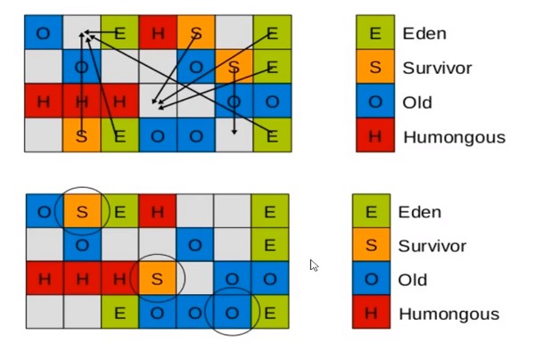

#### 新生代垃圾收集器
- Serial收集器:
  - 介绍:单线程收集器(开启:-XX:+UseSerialGC)
  - 特点:新生代复制算法,简单而高效，但是单线程收集，无法利用当前多核CPU,
  - 使用场景:在桌面应用中内存很小，不用线程切换，所以在Client模式下是个好选择

- ParNew收集器
  - 介绍:就是Serial的多线程版本(开启:-XX:+UseParNewGC)
  - 特点:新生代复制算法,多线程收集，更加适合当前多核CPU的情况，可以做到新生代并发收集
  - 使用场景:搭配CMS使用

- Parallel Scavenge收集器
  - 介绍:同样是多线程收集(开启:-XX:++UseParallelOldGC),新生代复制算法,与ParNew的区别在于该收集器目的是达到一个可控制的吞吐量（吞吐量=运行用户代码时间/运行用户代码时间+垃圾收集时间）
    - 特点:更加关注的是吞吐量可控,减少垃圾收
  - 使用场景:高吞吐量为目标，即减少垃圾收集时间，让用户代码获得更长的运行时间，当应用程序运行在具有多个CPU上，对暂停时间没有特别高的要求时，即程序主要在后台进行计算，而不需要与用户进行太多交互；
  - 注意：垃圾收集所花费的时间是年轻一代和老年代收集的总时间；如果没有满足吞吐量目标，则增加代的内存大小以尽量增加用户程序运行的时间(这样就会导致STW的时间增加)；
#### 老年代垃圾收集器
- Serial old
  - 介绍:Serial Old是 Serial收集器的老年代版本
  - 特点:"标记-整理"算法（还有压缩，Mark-Sweep-Compact）,单线程收集
  - 使用场景:作为CMS收集器的后备预案，在并发收集发生Concurrent Mode Failure时使用
- Parallel  old
  - 介绍: Parallel Old垃圾收集器是Parallel Scavenge收集器的老年代版本；
  - 优点:采用"标记-整理"算法；
  - 缺点:多线程收集
  - 使用场景:与Parallel Scavenge搭配使用做在注重吞吐量以及CPU资源敏感的场景中使用

- CMS
  - 介绍:并发标记清理（Concurrent Mark Sweep，CMS）收集器也称为并发低停顿收集器（Concurrent Low Pause Collector）或低延迟（low-latency）垃圾收集器(开启:-XX:+UseConcMarkSweepGC)；
  - 特点: 基于"标记-清除"算法(不进行压缩操作，产生内存碎片),以获取最短回收停顿时间为目标；
  - 过程:
    1. **初始标记（CMS initial mark）**:仅标记一下GC Roots能直接关联到的对象,需要SWT
    2. **并发标记（CMS concurrent mark）**:进行GC Roots Tracing的过程；刚才产生的集合中标记出存活对象,与用户线程并发进行
    3. **重新标记（CMS remark）**:修整在并发标记期间用户线程导致的标记变动的对象重新标记，需要SWT
    4. **并发清除（CMS concurrent sweep）**:回收所有的垃圾对象
  - 使用场景:希望系统停顿时间最短，注重服务的响应速度,如常见WEB、B/S系统的服务器上的应用。
  - CMS问题:
    1. 对CPU资源非常敏感
    2. 浮动垃圾（Floating Garbage）:在并发清除时，用户线程新产生的垃圾，称为浮动垃圾,当CMS预留空间不足时会出现Concurrent Mode Failure失败
    3. CMS基于"标记-清除"算法，清除后不进行压缩操作，产生大量内存碎片，需要指定"-XX:+UseCMSCompactAtFullCollection在执行fullGC之后就执行整理"或者"-XX:+CMSFullGCsBeforeCompaction多少次FullGC之后进行整理"

#### 混合垃圾收集器
- G1
  - 介绍:服务端垃圾收集器，在多处理器环境与大容量的内存中，在实现高吞吐量的同时还尽可能的减少垃圾收集器停顿的时间。化整为零
  - 特点：
    1. G1能充分利用多CPU与适应更大的内存，尽量缩短STW
    2. G1在整体上是标记整理算法，局部(两个Region)之间是复制算法，所以不产生内存碎片
    3. 宏观上G1已经不分老年代与年轻带。把内存划分为多个Region(最多2024，每个最大32M，也就是最大支持64G)
    4. G1收集器每个Region都可以是老年代或者是新生代，并且不是物理隔离，同样可以采用不同的GC方式处理不同的区域
    5. 内存区域不存在物理上的老年代与年轻代的划分，不需要独立的Survivor堆做复制，G1只有逻辑分代，每个分区可能在G1的运行在不同的代之间切换
  - 过程:
    - Young GC:主要是对Eden区进行GC，它在Eden空间耗尽时触发
      - Eden空间的数据移动到Survivor空间中，如果Survivor空间不够，Eden空间的部分数据会晋升到老年代
      - Survivor区的数据移动到新的Survivor中，也有部分晋升到老年代空间中
      - 最终Eden空间数据为空，GC停止工作，应用线程继续执行
    - Mix GC: 当越来越多的对象晋升到老年代后，为了避免堆内存被耗尽，虚拟机会触发一个混合的垃圾收集器，除了回收整个Young Region还会回收一部分的Old Region(这里会根据指定的最大回收时间，回收价值最大的)
      - 触发时机由参数-XX:InitiatingHeapOccupancyPercent=n，默认为45%，当老年代大小占到整个堆的多少百分比的时候就触发
      - GC分为两步:
        1. 全量并发标记
           - 初始标记(Initial mark,STW):标记从根节点直接可达对象，这个阶段会执行一次年轻代GC，会产生全局停顿。
           - 根区域扫描(root region scan):GC在初始标记的存活区扫描对老年代的引用，并标记被引用的对象
           - 并发标记(Concurrent Marking): GC在整个堆中查找可访问的对象
           - 重新标记(Remark，STW):对上一次的标记进行修正
           - 清除垃圾(Cleanup,STW):清点与重置标记状态，这个阶段并不会实际上去做垃圾的收集，等待Evacuation阶段来回收。
        2. 拷贝存活对象
           - Evacuation阶段:该阶段把一部分Region里的存活的对象拷贝到另外一部分Region中，从而实现垃圾回收清理。

#### 垃圾收集器搭配
