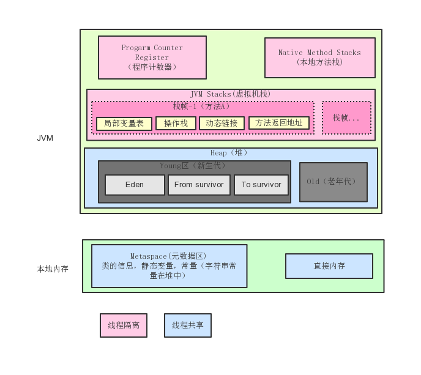

## 运行时数据区域

### 基本概念与图解

```text
Java虚拟机在执行Java程序的过程中会把它所管理的内存划分为诺干个不同的数据区，包括如下图所示
```




### 区域详解

#### 1. 本地发方法栈（Native Method Stack）

- 作用于虚拟机栈相似（具体请看下面的虚拟机栈部分）
- 为JVM使用Native方法服务
- 同样与虚拟机栈一样也会根据情况抛出StackOverflowError与OutOfMemoryError

#### 2. 程序计数器（Program count Register）

- 每个线程都有自己的程序计数器，代表着当前线程所执行的字节码的行号指示器
- 字节码解释器通过改变这个计数器来选取吓一跳需要去执行的字节码指令（循环，跳转，异常，线程恢复等）
- 如果下一步执行的是一个Native的方法，计数器的值就会空了（Undefined）
- 此区域不会出现OutOfMemoryError的情况

#### 3. 虚拟机栈(JVM Stacks)

```text
虚拟机栈的栈元素是栈帧，当有一个方法被调用时，代表这个方法的栈帧入栈；当这个方法返回时，其栈帧出栈。因此，虚拟机栈中栈帧的入栈顺序就是方法调用顺序。
栈中保存的基本数据类型的对象和自定义对象的引用。
```
- 局部变量表(LocalVariableTable):用于存放防区参数和方法内部定义的局部变量
- 操作栈：是用来存放方法执行过程中的元素以及字节码指令的
- 动态链接：每个栈帧都包含一个指向运行时常量池中该栈所属方法的符号引用，持有这个引用的目的是为了支持方法调用过程中的动态连接(Dynamic Linking)。
这些符号引用一部分会在类加载阶段或者第一次使用时就直接转化为直接引用，这类转化称为静态解析。另一部分将在每次运行期间转化为直接引用，这类转化称为动态连接
- 方法返回地址：方法退出的出口

#### 4. 方法区(Method Area)

- JVM中所有的线程共享的一块区域
- 在1.8中才有的把原来的永久代移除了
- 元空间是放在本地内存中的不是放在JVM中的
- 存放类元信息、字段、静态属性、方法、常量,即时编译器编译后的代码等
- 字符串常量移动到了Heap中

#### 5. 堆（Heap）
- 堆是所有线程共享的一块内存区域，在虚拟机启动时创建
- 此内存区域的唯一目的就是存放对象实例，几乎所有的对象实例都在这里分配内存
- OutOfMemoryError异常。如果在堆中没有内存完成实例分配，并且堆也无法扩展时抛出

