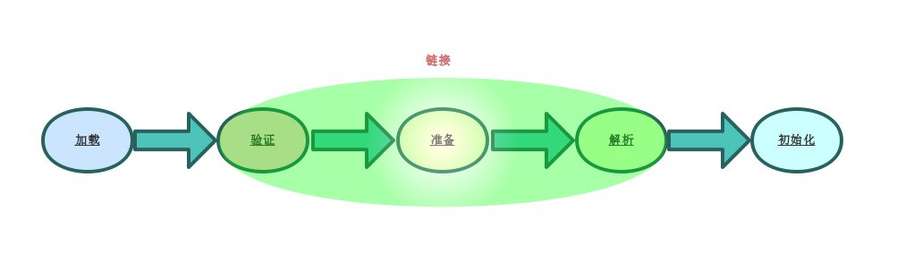
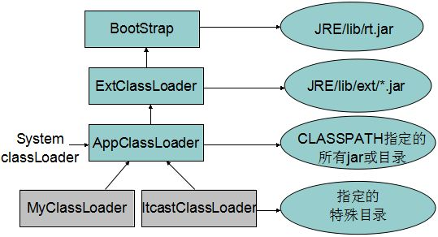

## 类加载的三个阶段



### 1. 加载

 	1. 通过一个全限定类名来获取定义改类的二进制字节流
 	2. 通过这个字节流代表的静态存储结构转化为方法区运行时数据结构
 	3. 在内存中生成一个代表这个类的Class对象，作为方法区这个类的各种数据的访问入口

###  2. 链接

- **验证**：
  1. **文件格式验证**：检查当前Class文件格式规范，是否能被当前虚拟机处理
     - 验证魔术因子是否正确，0xCAFEBABE
     - 验证主次版本号是否符合当前虚拟机
     - 常量池中的常量类型是否支持
     - etc
  2. **元数据验证**：对字节码信息进行语义分析，保证符合Java语言规范
     - 这个类是否有父类
     - 这个类的父类是否继承了不允许被继承的类
     - 检查这个类是否是抽象类，是否已经实现了父类或者接口中要求实现的方法
     - 类中的字段，方法等是否跟父类矛盾
     - etc
  3.  **字节码验证**：对于数据流与控制流的分析，保证程序语义合法
     - 保证任意时刻操作数栈的数据类型与指令代码序列都能配合工作
     - 保证跳转指令不会跳转到方法体以外的字节码指令上
     - 保证发放题中类型的转换是有效的
     - etc
  4. **符号引用验证**：类对自身以外的信息进行匹配性校验
     - 符号应用中通过全限定名能找到对应的类
     - 在指定的类中是否存在符合方法的字段描述符
     - 符号引用中的类，字段，方法的访问权限，是否可以被当前类所访问
     - etc
- **准备**: 为类变量分类内存并且为类变量设置初始值
- **解析**：把符号引用转换成直接引用的过程
  1. 类与接口的解析
  2. 字段解析
  3. 类方法解析
  4. 接口方法解析

### 3. 初始化

- 类初始化过程就是执行类构造器<clinit>()方法的过程

  - <clinit>():

    1. 该方法是由编译器自动收集类中的类变量的赋值动作与静态语句块（statis{}）中的语句合并产生的
    2. 该方法与实例构造器<init>()方法不同，他不需要显示的调用父类的类构造器，虚拟机会保证在子类的<clinit>()执行之前，父类的<clinit>()已经执行完毕了
    3. 父类的静态语句块先于子类的静态语句块执行（从2中就可以看出这点）
    4. <clinit>()并不是必须的，如果一个类或者接口没有类变量跟静态语句块，那么编译器并不会生成<clinit>()方法
    5. 虚拟机保证了<clinit>()的线程安全

## 类加载器

### 1. 概念

- **类加载器的作用**:把类的二进制字节流加载到JVM中
- **定义类加载器**：由那个类加载的这个Class那个那个类加载器就是该Class的定义类加载器
- **初始类加载器**：可通过一致获取getParent获取到的类加载器都是该Class的初始类加载器
- **父子类加载器之间的关系**：是包装关系，父是被包装的
- **类加载器的命名空间**：命名空间由该类加载器及其所有父加载器所加载的类组成的
- **类记载器运行时包**：父类加载器是看不到子类加载器加载的类饿不同

### 2. 分类

- **启动类加载器**（Bootstrap ClassLoad):一般加载<JAVA_HOME>\bin目录中的rt.jar文件中Class
- **扩展类加载器**(Extension ClassLoad)：一般加载<JAVA_HOME>\lib\etc目录中的.jar文件中Class
- **系统类加载器**(Application ClassLoad)：它负责加载用户类路径(ClassPath)上所指定的类库一般来说不自定义自己的类加载器的情况下一般都是用的这个类加载器加载
- **自定义类加载器**：继承ClassLoad复写findClass方法

### 3. 双亲委派模型

- 概念：如果一个类加载器收到一个类加载的请求，它首先并不会自己去加载这个类，而是把这个请求委托给自己的父加载器去完成，只有当父加载器返回自己无法完成这个加载请求时，子加载器才会尝试自己去加载。
- 图解



### 4. 打破双亲委派
- 继承ClassLoader,复写loadClass，findClass方法
```Java
public class SimpleObject {
}
```

```Java
//自定义的ClassLoad
public class SimpleObjectClassLoad extends ClassLoader {
    @Override
    protected Class<?> loadClass(String name, boolean resolve) throws ClassNotFoundException {
        if (name.startsWith("java.")) {
           return super.loadClass(name, resolve);
        }
        return findClass(name);
    }

    @Override
    protected Class<?> findClass(String name) throws ClassNotFoundException {
        String classPath = name.replace(".", "/");
        File file = new File("E:\\ideaWork\\learn\\knowledge\\数据结构与算法\\常见算法\\target\\classes\\" + classPath + ".class");
        try (FileInputStream inputStream = new FileInputStream(file);
             ByteArrayOutputStream byteArrayOutputStream = new ByteArrayOutputStream()) {
            byte[] buffer = new byte[1024];
            int len;
            while ((len = inputStream.read(buffer)) != -1) {
                byteArrayOutputStream.write(buffer, 0, len);
            }
            byteArrayOutputStream.flush();
            byte[] bytes = byteArrayOutputStream.toByteArray();
            return this.defineClass(name, bytes, 0, bytes.length);
        } catch (IOException e) {
            e.printStackTrace();
            return null;
        }

    }
}
```

```java
public class Test {

    public static void main(String[] args) {
        try {
            System.out.println(Thread.currentThread().getContextClassLoader());
            Class<?> aClass1 = Thread.currentThread().getContextClassLoader().loadClass("com.learn.algorithm.list.SimpleObject");
            System.out.println(aClass1.hashCode());
            SimpleObject simpleObject1 = (SimpleObject) aClass1.newInstance();
            SimpleObjectClassLoad simpleObjectClassLoad = new SimpleObjectClassLoad();
            System.out.println(simpleObject1);
            /**
             * 因为当前加载Test的类加载器是APPClassLoad，无法看到simpleObjectClassLoad加载的	 
             * SimpleObject的Class，在不同的命名空间中，在下面强转时，实际上强转的是APPClassLoad下
             * 的SimpleObject的Class,所以会报错无法强转
             */
            Class<?> aClass = simpleObjectClassLoad.loadClass("com.learn.algorithm.list.SimpleObject", false);
            System.out.println(aClass.hashCode());
            SimpleObject simpleObject = (SimpleObject) aClass.newInstance();
            System.out.println(aClass.getClassLoader().getParent());
        } catch (ClassNotFoundException | IllegalAccessException | InstantiationException e) {
            e.printStackTrace();
        }
    }
}
```

```java
//输出结果
sun.misc.Launcher$AppClassLoader@18b4aac2
897913732
com.learn.algorithm.list.SimpleObject@6adca536
627185331
Exception in thread "main" java.lang.ClassCastException: com.learn.algorithm.list.SimpleObject cannot be cast to com.learn.algorithm.list.SimpleObject
	at com.learn.algorithm.list.Test.main(Test.java:24)
Disconnected from the target VM, address: '127.0.0.1:8524', transport: 'socket'
```
- 使用线程上下文类加载器  
[线程上下文类加载器](https://blog.csdn.net/zhoudaxia/article/details/35897057)(这里需要再研究一下，感觉自己理解的不到位)


