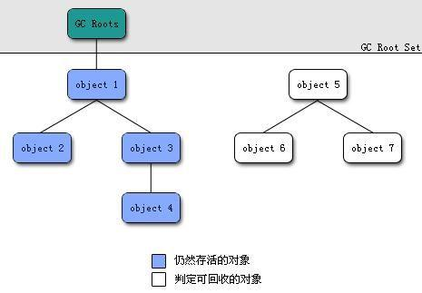
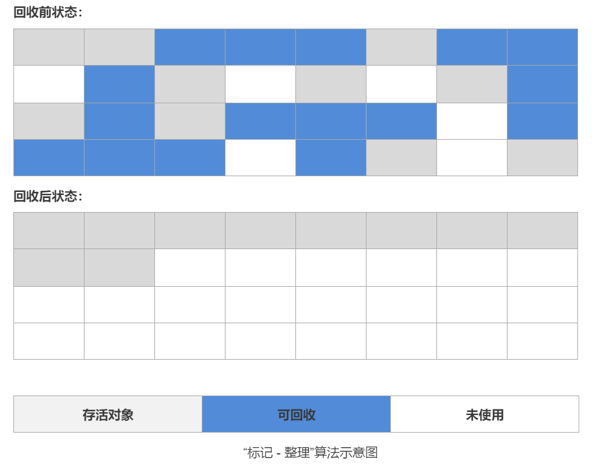
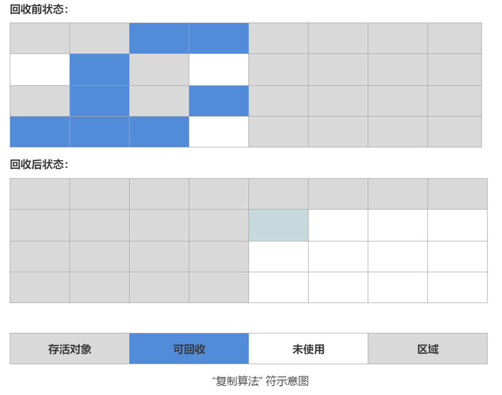
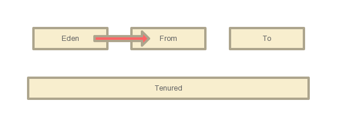
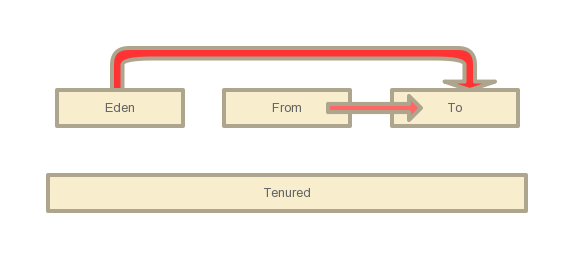
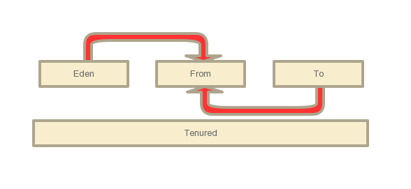
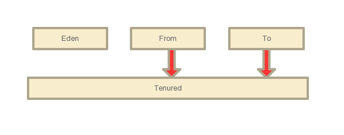

## 概述

> 在Java中内存的动态回收技术是由垃圾收集器（Garbage Collection，GC）进行的，在[JVM的运行时数据区](./JVM运行时数据区.md)中程序计数器，虚拟机栈，本地方法栈，都是都是线程私有的，生命周期伴随着线程，所以在垃圾回收时只需要回收堆与方法区中的已经‘死亡’的对象
>

## GC日志分析
[Full GC (Metadata GC Threshold) [PSYoungGen: 46630K->0K(1120768K)] [ParOldGen: 101245K->143247K(418304K)] 147876K->143247K(1539072K), [Metaspace: 159795K->159790K(1198080K)], 0.1861627 secs] [Times: user=0.52 sys=0.00, real=0.19 secs]

## 对象死亡

- **概念**:当一个对象不再被任何途径使用，就代表这个对象已经死亡

- **判断算法**:判断一个对象是否已经死亡

  - **引用计数算法**

    - **基本原理**:给对象提供一个引用计数器，每当有一个地方引用他的时候引用计数+1，当引用失效是就-1，当引用为0时，垃圾回收器回收时就会回收这个对象。

    ```java
    Test test=new Test();//referenceCount=1
    test2=test;//referenceCount=2
    test=null;//referenceCount=1
    ```

    - **优点**:实现简单，效率高

    - **缺点**:无法解决对象之间循环引用的问题


  - **可达性分析算法**（JVM使用）

     - **基本原理**：通过一系列称为GC Roots的对象作为起点，往下进行搜索，搜索的路径称为引用链，当一个对象到GC Roots没有任何引用链，就代表这个对象不可用。
       
     - **优点**：可以很好的解决引用计数法对象之间循环引用导致不可回收问题

     - **缺点**：实现困难，相比计数效率要低一些

     - **可以作为GC Root的对象**：
       1. 虚拟机栈用引用的对象
       2. 方法区中类静态属性引用的对象
       3. 方法区中常量引用的对象
       4. 本地方法栈中JNI引用的对象

## 垃圾回收基本算法

- **标记-清除算法**

  - **基本原理**:分为两个阶段（标记，清除），先标记出所有需要回收的对象，在标记完成后，当发送GC时统一回收所有被标记的对象。

    

  - **优点**：算法简单（[可以查看算法与数据结构基本概念中的Array部分](../../数据结构与算法/数据结构的基本概念.md)）

  - **缺点**：

    1. 标记与清除两个阶段的效率都不高，
    2. 在清除阶段，对于清除后的空间会产生大量的内存碎片

- **复制算法**

  - **基本概念**：将内存划分为两块同等大小的内存块，每次只用其中的一块，当一块使用完时，就将存活的对象复制到另外一块上，然后把原来的那一块内存空间清理掉。

    

  - **优点**：

    1.  每次都是对一般的区域进行回收，在复制后是完全清除之前内存块，所以不会有内存碎片
    2. 只需要移动堆顶的指针，顺序按需分配，实现简单，效率高

  - **缺点**：浪费内存，只能用于一般的内存

- **标记-整理算法**

  - **基本概念**：跟标记清除算法一样同样是两个阶段，标记出可回收的对象，让存货的对象向一端移动，然后清理掉端边界以外的内存。

    

  - **优点**：解决了标记清除算法中内存碎片的问题

  - **缺点**：相比于复制算法没有那么高效

## 分带回收算法

- **基本概念**：因为在实际情况中JVM的堆根据对象的生命周期不同，把堆划分为了几个模块分成了老年代与年轻代，年轻代又可以分为（Eden,From survivor,To survivor),每个区域的对象的生命周期是不同的，按照区域实际情况可以使用不同的回收算法，这就是分带回收。

- **GC分类**：

  - **Minor GC**：新生代的垃圾回收，MinorGC非常频繁，回收速度快

  - **Major GC**：老年代GC，回收慢

  - **Full GC**:等于Minor GC+Major GC(大部分JVM在进行Major的时候伴随着Minor，所以大部分情况下Major GC与Full GC等同)

- **回收过程**：

  - 当创建一个对象放到Eden区时，第一次Eden区满了触发了MinorGC,会将存活的对象复制到From

    

  - Eden清理完后，再次满时又触发了MinorGC，会将Eden与From区存活的对象复制到To区

    

  - Eden清理完后，再次满时又触发了MinorGC，会将Eden与To区存活的对象复制到From区

    

  - 进过阈值次(默认值为15)MinorGC之后，对象在From与To之间来回游荡，一起复制到Tenured

    

  - 当老年代满了的时候，就进行FullGC

[oopMap](https://www.cnblogs.com/strinkbug/p/6376525.html?utm_source=itdadao&utm_medium=referral)
## 如何确保新生代对象被老年代对象引用的时候不被gc？

当老年代存活对象多时，每次minor gc查询老年代所有对象影响gc效率（因为gc stop-the-world），所以在老年代有一个write barrier（写屏障）来管理的card table（卡表），card table存放了所有老年代对象对新生代对象的引用。所以每次minor gc通过查询card table来避免查询整个老年代，以此来提高gc性能。

## 内存分配与回收策略

- **大对象直接进入老年代**:大对象需要连续的内存空间(如很长的字符串，很大的byte[]),新生代空间比较小，所以这种大对象直接放入老年代
- **长期存活的对象进入老年代**：经历过多次(默认是15)minor GC后依旧存活的对象会放入到老年代中
- **动态对象年龄判断**:不是所有的对象的年龄达到阈值才会进入老年代，如果当前年龄相同的对象大小之和大于Survivor的一半就会会把大于等于这些年龄的对象放入到老年代中
- **空间分配担保**
