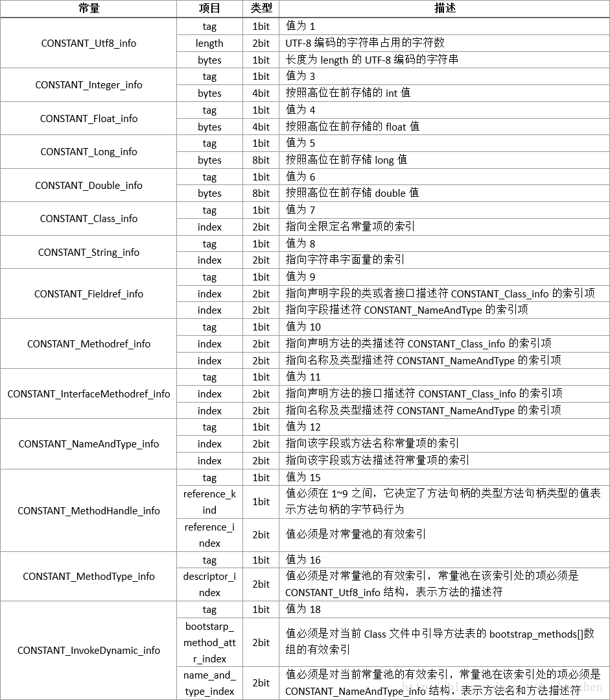
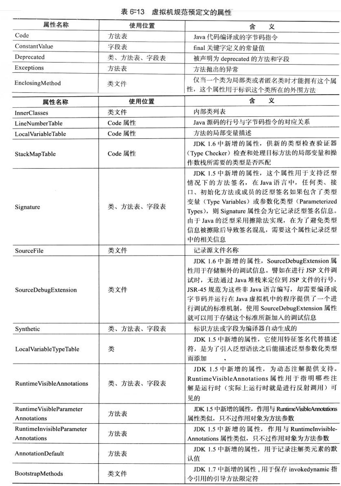

### 概述
 - **无符号数**:属于基本的数据类型，以u1,u2,u4,u8来分别代表1个字节，2个字节，4个字节和8个字节的无符号数；可用来描述数字，索引引用，数量值或者按照UTF-8编码构成的字符串值
- **表**:是由多个无符号数或者其他表作为数据项构成的复合数据类型，所有表都习惯性地以“_info”结尾。表用于描述由层次关系的复合结构的数据，整个Class文件本质上就是一张表。

### Class文件格式


### 常量池

  - 常量池中主要存放两大类常量：字面量（Literal）和符号引用。字面量接近Java语言层面的常量概念，如文本字符串、声明为final的常量值等。符号引用属于编译原理的概念，包括三类常量：
       1. 类和接口的全限定名(Full Qualified Name)
       2. 字段的名称和描述符(Descriptor)
       3. 方法的名称和描述符。

  - 常量池中的14种常量项的结构总表
    

### 类访问标志
- **access_flags** :用于识别一些类或者接口层次的访问信息，包括：这个Class是类还是接口、是否为public类型、是否为abstract类型、类是否声明为final等。标志位及其含义如下表：

|    标志名称    | 标志值 |                             含义                             |
| :------------: | :----: | :----------------------------------------------------------: |
|   ACC_PUBLIC   | 0X0001 |                       是否为public类型                       |
|   ACC_FINAL    | 0X0010 |              是否被声明为final，只有类可以设置               |
|   ACC_SUPER    | 0X0020 | 是否允许使用invokespecial字节码指令的新语意，invokespecial指令的语意在JDK1.0.2发生过改变，为了区别这条指令使用哪种语意，JDK1.0.2之后编译 |
| ACC_INTERFACE  | 0X0200 |                       标志这是一个接口                       |
|  ACC_ABSTRACT  | 0X0400 | 是否为abstract类型，对于接口或者抽象类来说，此标志值为真，其他类为假 |
| ACC_SYNTHETIC  | 0X1000 |                标志这个类并非由用户代码产生的                |
| ACC_ANNOTATION | 0X2000 |                       标志这是一个注解                       |
|    CC_ENUM     | 0X4000 |                       标志这是一个枚举                       |

- 注意：access_flags标志是上面标识值或运算的结果，例如ACC_PUBLIC|ACC_SUPER=0x0021

### 类索引，父类索引与接口索引的集合

- Class中类索引（this_class），父类索引(super_class)与接口索引(interfaces)确定这个类的继承关系。	

### 字段表集合

- **字段表（filed_info）**:用于描述几口或者类中声名的变量。

- **字段表结构**：

  |      类型      |       名称       |      数量       |
  | :------------: | :--------------: | :-------------: |
  |       u2       |   access_flags   |        1        |
  |       u2       |    name_index    |        1        |
  |       u2       | descriptor_index |        1        |
  |       u2       | attribute_count  |        1        |
  | attribute_info |    attributes    | attribute_count |

- **字段访问标识（access_flags）**：与类的访问标识差不多，计算方式也相同

|   标志名称    | 标志值 |            含义            |
| :-----------: | :----: | :------------------------: |
|  ACC_PUBLIC   | 0X0001 |      是否为public类型      |
|  ACC_PRIVATE  | 0X0002 |      字段是否private       |
| ACC_PROTECTED | 0X0004 |     字段是否protected      |
|  ACC_STATIC   | 0X0008 |       字段是否static       |
|   ACC_FINAL   | 0X0010 |       字段是否final        |
| ACC_VOLATILE  | 0X0040 |       段是否volatile       |
| ACC_TRANSIENT | 0X0080 |     字段是否transient      |
| ACC_INTERFACE | 0X0200 |      标志这是一个接口      |
| ACC_SYNTHETIC | 0X1000 | 字段是否由编译器自动产生的 |
|    CC_ENUM    | 0X4000 |      标志这是一个枚举      |

- **描述符标识字符含义**：用来描述字段的数据类型，方法的参数列表（包括数量，类型以及顺序）和返回值。

| 标识字符 |             含义              |
| :------: | :---------------------------: |
|    B     |         基本类型byte          |
|    C     |         基本类型char          |
|    D     |        基本类型double         |
|    F     |         基本类型float         |
|    I     |          基本类型int          |
|    J     |         基本类型long          |
|    S     |         基本类型short         |
|    Z     |        基本类型boolean        |
|    V     |         特殊类型void          |
|    L     | 对象类型。如Ljava/lang/Object |

### 方法表集合

- **方法表(method_info)**:方法描述与方法内属性的描述

|      类型      |       名称       |      数量       |
| :------------: | :--------------: | :-------------: |
|       u2       |   access_flags   |        1        |
|       u2       |    name_index    |        1        |
|       u2       | descriptor_index |        1        |
|       u2       | attribute_count  |        1        |
| attribute_info |    attributes    | attribute_count |

- **方法访问标识**：

|     标志名称     | 标志值 |              含义              |
| :--------------: | :----: | :----------------------------: |
|    ACC_PUBLIC    | 0X0001 |        是否为public类型        |
|   ACC_PRIVATE    | 0X0002 |        字段是否private         |
|  ACC_PROTECTED   | 0X0004 |       字段是否protected        |
|    ACC_STATIC    | 0X0008 |         字段是否static         |
|    ACC_FINAL     | 0X0010 |         字段是否final          |
| ACC_SYNCHRONIZED | 0X0020 |      方法是否synchronized      |
|    ACC_BRIDGE    | 0X0040 | 方法是否由编译器产生的桥接方法 |
|   ACC_VARARGS    | 0X0080 |      方法是否接受不定参数      |
|    ACC_NATIVE    | 0X0100 |        方法是否为native        |
|   ACC_ABSTRACT   | 0X0400 |       方法是否为abstract       |
|   ACC_STRICTFP   | 0X0800 |       方法是否为strictfp       |
|  ACC_SYNTHETIC   | 0X1000 |    防范是否由编译器自动产生    |

- 注意：方法内的代码会放在属性表中名称为**Code**里面，并且编译器会帮你生成"<cinit>"方法，如果没有构造方法同时会帮你生成"<init>"方法

### 属性表集合

- 在**Class文件、字段表、方法表、属性表**都可以携带自己的属性表集合，用于描述某些场景专有的信息
- **虚拟机规范预定义属性**



- **属性表结构(attributes_info)**

| 类型 |         名称         |       数量       |
| :--: | :------------------: | :--------------: |
|  u2  | attribute_name_index |        1         |
|  u4  |   attribute_length   |        1         |
|  u1  |         info         | attribute_length |

- **Code属性集合**：**最终变为字节码指令存储在Code属性中**，Code属性出现在方法表的属性集合之中。但并非所有方法表都有Code属性，例如抽象类或接口

|      类型      |          名称          |          数量          |
| :------------: | :--------------------: | :--------------------: |
|       u2       |  attribute_name_index  |           1            |
|       u4       |    attribute_length    |           1            |
|       u2       |       max_stack        |           1            |
|       u2       |       max_locals       |           1            |
|       u4       |      code_length       |           1            |
|       u1       |          code          |      code_length       |
|       u2       | exception_table_length |           1            |
| exception_info |    exception_table     | exception_table_length |
|       u2       |    attribute_count     |           1            |
| attribute_info |       attributes       |    attribute_count     |

- **异常表的结构**


| 类型 |    名称    | 数量 |
| :--: | :--------: | :--: |
|  u2  |  start_pc  |  1   |
|  u2  |   end_pc   |  1   |
|  u2  | handle_pc  |  1   |
|  u2  | catch_type |  1   |

- **LineNumberTable**:属性用于描述Java源码行号与字节码行号（字节码的偏移量）之间的对应关系。

|       类型       |           名称           |           数量           |
| :--------------: | :----------------------: | :----------------------: |
|        u2        |   attribute_name_index   |            1             |
|        u4        |     attribute_length     |            1             |
|        u2        | line_number_table_length |            1             |
| line_number_info |    line_number_table     | line_number_table_length |

- **LocalVariableTable**属性用于描述栈帧中局部变量表中的变量与Java源码中定义的变量之间的关系。

   |       类型       |            名称            |            数量            |
| :--------------: | :------------------------: | :------------------------: |
|        u2        |    attribute_name_index    |             1              |
|        u4        |      attribute_length      |             1              |
|        u2        | local_varible_table_length |             1              |
| line_number_info |    local_variable_table    | local_varible_table_length |

  - **local_variable_info**:一个栈帧与源码中的局部变量的关联

| 类型 |    名称    | 数量 |
| :--: | :--------: | :--: |
|  u2  |  start_pc  |  1   |
|  u2  |  length   |  1   |
|  u2  | name_index  |  1   |
|  u2  | descriptor_index |  1   |
| u2 | index | 1 |

- **SourceFile**：属性用于记录生成这个Class文件的源码文件名称。

| 类型 |    名称    | 数量 |
| :--: | :--------: | :--: |
|  u2  |  attribute_name_index  |  1   |
|  u4  | attribute_length |  1   |
|  u2  | sourcefile_index |  1   |

- **ConstantValue**：属性的作用是通知虚拟机自动为静态变量赋值。只有被static关键字修饰的常量（类变量）才可以使用这项属性。目前Sun Javac编译器的选择是：**如果同时使用final和static来修饰一个变量，并且这个变量的数据类型是基本类型或者java.lang.String的话，就生成ConstantValue属性来进行初始化，如果这个变量没有被final修饰，或者并非基本类型及字符串，则将会选择在\<clinit>方法中进行初始化。（不是static 的是在\<init>方法中进行初始化）**
| 类型 |    名称    | 数量 |
| :--: | :--------: | :--: |
|  u2  |  attribute_name_index  |  1   |
|  u4  | attribute_length |  1   |
|  u2  | constantvalue_index |  1   |

- **InnerClasses**：属性用于记录内部类与宿主类之间的关联。

   |        类型        |         名称         |       数量        |
| :----------------: | :------------------: | :---------------: |
|         u2         | attribute_name_index |         1         |
|         u4         |   attribute_length   |         1         |
|         u2         |  number_of_classes   |         1         |
| inner_classes_info |    inner_classes     | number_of_classes |

  - **inner_classes_info**

| 类型 |    名称    | 数量 |
| :--: | :--------: | :--: |
|  u2  |  inner_class_info_index  |  1   |
|  u2  | outer_class_info_index |  1   |
|  u2  | inner_name_index |  1   |
|  u2  | inner_class_access_flags |  1   |

### 实战分析

- 源代码

```java
public class User extends Thread implements Serializable {

    public static final long serialVersionUID = 1L;

    private String userName;

    private static int x = 10;

    public void setUserName(String userName) {
        this.userName = userName;
    }


}
```

- Javap -v User.class

```java
public class com.learn.algorithm.test.User extends java.lang.Thread implements java.io.Serializable
  minor version: 0
  major version: 52
  flags: ACC_PUBLIC, ACC_SUPER
Constant pool:
   #1 = Methodref          #5.#28         // java/lang/Thread."<init>":()V
   #2 = Fieldref           #4.#29         // com/learn/algorithm/test/User.userName:Ljava/lang/String;
   #3 = Fieldref           #4.#30         // com/learn/algorithm/test/User.x:I
   #4 = Class              #31            // com/learn/algorithm/test/User
   #5 = Class              #32            // java/lang/Thread
   #6 = Class              #33            // java/io/Serializable
   #7 = Utf8               serialVersionUID
   #8 = Utf8               J
   #9 = Utf8               ConstantValue
  #10 = Long               1l
  #12 = Utf8               userName
  #13 = Utf8               Ljava/lang/String;
  #14 = Utf8               x
  #15 = Utf8               I
  #16 = Utf8               <init>
  #17 = Utf8               ()V
  #18 = Utf8               Code
  #19 = Utf8               LineNumberTable
  #20 = Utf8               LocalVariableTable
  #21 = Utf8               this
  #22 = Utf8               Lcom/learn/algorithm/test/User;
  #23 = Utf8               setUserName
  #24 = Utf8               (Ljava/lang/String;)V
  #25 = Utf8               <clinit>
  #26 = Utf8               SourceFile
  #27 = Utf8               User.java
  #28 = NameAndType        #16:#17        // "<init>":()V
  #29 = NameAndType        #12:#13        // userName:Ljava/lang/String;
  #30 = NameAndType        #14:#15        // x:I
  #31 = Utf8               com/learn/algorithm/test/User
  #32 = Utf8               java/lang/Thread
  #33 = Utf8               java/io/Serializable
{
  public static final long serialVersionUID;
    descriptor: J
    flags: ACC_PUBLIC, ACC_STATIC, ACC_FINAL
    ConstantValue: long 1l

  public com.learn.algorithm.test.User();
    descriptor: ()V
    flags: ACC_PUBLIC
    Code:
      stack=1, locals=1, args_size=1
         0: aload_0
         1: invokespecial #1                  // Method java/lang/Thread."<init>":()V
         4: return
      LineNumberTable:
        line 9: 0
      LocalVariableTable:
        Start  Length  Slot  Name   Signature
            0       5     0  this   Lcom/learn/algorithm/test/User;

  public void setUserName(java.lang.String);
    descriptor: (Ljava/lang/String;)V
    flags: ACC_PUBLIC
    Code:
      stack=2, locals=2, args_size=2
         0: aload_0
         1: aload_1
         2: putfield      #2                  // Field userName:Ljava/lang/String;
         5: return
      LineNumberTable:
        line 18: 0
        line 19: 5
      LocalVariableTable:
        Start  Length  Slot  Name   Signature
            0       6     0  this   Lcom/learn/algorithm/test/User;
            0       6     1 userName   Ljava/lang/String;

  static {};
    descriptor: ()V
    flags: ACC_STATIC
    Code:
      stack=1, locals=0, args_size=0
         0: bipush        10
         2: putstatic     #3                  // Field x:I
         5: return
      LineNumberTable:
        line 15: 0
}
SourceFile: "User.java"

```

- class文件16进制分析
   - 按照Class文件格式解析
        - <font face="黑体" color=#EA0000>CA FE BA BE</font> : java的魔术因子，代表了一个Class类
        - <font face="黑体" color=#EA0000>00 00</font> :次版本号
        - <font face="黑体" color=#EA0000>00 34</font> ：主版本号
        - <font face="黑体" color=#EA0000>00 22</font> ：常量池数量，代表后面有34-1个常量
        - <font face="黑体" color=#EA0000>0A 00 05 00 1C</font>:常量一
            - <font face="黑体" color=#EA0000>0A </font>: Methodref_info
            - <font face="黑体" color=#EA0000>00 05</font>: Class_info索引值5
            - <font face="黑体" color=#EA0000>00 1C</font>: NameAndType索引值28
        - <font face="黑体" color=#EA0000>09 00 04 00 1D</font>:常量二
            - <font face="黑体" color=#EA0000>09 </font>: Fieldref_info
            - <font face="黑体" color=#EA0000>00 04</font>: Class_info索引值4
            - <font face="黑体" color=#EA0000>00 1D</font>: NameAndType索引值29
        - <font face="黑体" color=#EA0000>09 00 04 00 1E</font>:常量三
            - <font face="黑体" color=#EA0000>09 </font>: Methodref_info
            - <font face="黑体" color=#EA0000>00 04</font>: Class_info索引值4
            - <font face="黑体" color=#EA0000>00 1E</font>: NameAndType索引值30
        - <font face="黑体" color=#EA0000>07 00 1F</font>:常量四
            - <font face="黑体" color=#EA0000>07 </font>: Class_info
            - <font face="黑体" color=#EA0000>00 1F</font>: 全限定名常量项索引值31
        - <font face="黑体" color=#EA0000>07 00 20</font>:常量五
            - <font face="黑体" color=#EA0000>07 </font>: Class_info
            - <font face="黑体" color=#EA0000>00 20</font>: 全限定名常量项索引值32
        - <font face="黑体" color=#EA0000>07 00 21</font>:常量六
            - <font face="黑体" color=#EA0000>07 </font>: Class_info
            - <font face="黑体" color=#EA0000>00 21</font>: 全限定名常量项索引值33
        - <font face="黑体" color=#EA0000>01	00 10 73 65	72 69 61 6C	56 65 72 73	69 6F 6E 55	49 44
</font>:常量七
            - <font face="黑体" color=#EA0000>01 </font>: utf8_info
            - <font face="黑体" color=#EA0000>00 10</font>: 字符串占用了16字节
            - <font face="黑体" color=#EA0000>73 65	72 69 61 6C	56 65 72 73	69 6F 6E 55	49 44</font>: utf-8编码的字符串->serialVersionUID
        - <font face="黑体" color=#EA0000>01 00 01 4A</font>:常量八
            - <font face="黑体" color=#EA0000>01 </font>: utf8_info
            - <font face="黑体" color=#EA0000>00 01</font>: 字符串占用了1字节
            - <font face="黑体" color=#EA0000>4A</font>: utf-8编码的字符串->J
        - <font face="黑体" color=#EA0000>01	00 0D 43 6F	6E 73 74 61	6E 74 56 61	6C 75 65</font>:常量九
            - <font face="黑体" color=#EA0000>01 </font>: utf8_info
            - <font face="黑体" color=#EA0000>00 0D</font>: 字符串占用了13字节
            - <font face="黑体" color=#EA0000>43 6F	6E 73 74 61	6E 74 56 61	6C 75 65</font>: utf-8编码的字符串->ConstantValue
        - <font face="黑体" color=#EA0000>05	00 00 00 00	00 00 00 01</font>:常量十
            - <font face="黑体" color=#EA0000>05</font>: long_info
            - <font face="黑体" color=#EA0000>00 00 00 00 00 00 00 01</font>: 8个自己的long值->1L
        -  <font face="黑体" color=#EA0000>01	00	08	75	73	65	72	4E	61	6D	65</font>:常量十二
            - <font face="黑体" color=#EA0000>01 </font>: utf8_info
            - <font face="黑体" color=#EA0000>00	08</font>: 字符串占用了8字节
            - <font face="黑体" color=#EA0000>75	73	65	72	4E	61	6D	65</font>: utf-8编码的字符串->userName
        -  <font face="黑体" color=#EA0000>01 00 12 4C 6A	61	76	61	2F	6C	61	6E	67	2F	53	74	72	69	6E 67 3B</font>: 常量十三
            - <font face="黑体" color=#EA0000>01 </font>: utf8_info
            - <font face="黑体" color=#EA0000>00 12</font>: 字符串占用了18字节
            - <font face="黑体" color=#EA0000>4C 6A	61	76	61	2F	6C	61	6E	67	2F	53	74	72	69	6E 67 3B</font>: utf-8编码的字符串->Ljava/lang/String;
        - <font face="黑体" color=#EA0000>01 00 01 78</font>:常量十四
            - <font face="黑体" color=#EA0000>01 </font>: utf8_info
            - <font face="黑体" color=#EA0000>00 01</font>: 字符串占用了1字节
            - <font face="黑体" color=#EA0000>78</font>: utf-8编码的字符串->x
        - <font face="黑体" color=#EA0000>01 00 01 49</font>:常量十五
            - <font face="黑体" color=#EA0000>01 </font>: utf8_info
            - <font face="黑体" color=#EA0000>00 01</font>: 字符串占用了1字节
            - <font face="黑体" color=#EA0000>78</font>: utf-8编码的字符串->I
        - <font face="黑体" color=#EA0000>01	00	06	3C	69	6E 69 74 3E</font>: 常量十六
            - <font face="黑体" color=#EA0000>01 </font>: utf8_info
            - <font face="黑体" color=#EA0000>00 06</font>: 字符串占用了6字节
            - <font face="黑体" color=#EA0000>3C	69	6E 69 74 3E</font>: utf-8编码的字符串->\<init>
        - <font face="黑体" color=#EA0000>01	00 03 28 29 56</font>:常量十七
            - <font face="黑体" color=#EA0000>01 </font>: utf8_info
            - <font face="黑体" color=#EA0000>00 03</font>: 字符串占用了3字节
            - <font face="黑体" color=#EA0000>28 29 56</font>: utf-8编码的字符串->()V
        - <font face="黑体" color=#EA0000>01	00 04 43 6F 64 65</font>:常量十八
            - <font face="黑体" color=#EA0000>01 </font>: utf8_info
            - <font face="黑体" color=#EA0000>00 04</font>: 字符串占用了4字节
            - <font face="黑体" color=#EA0000>43 6F 64 65</font>: utf-8编码的字符串->Code
        - <font face="黑体" color=#EA0000>01	00	0F	4C	69	6E	65	4E	75	6D	62	65	72	54	61	62 5C 65</font>:常量十九
            - <font face="黑体" color=#EA0000>01 </font>: utf8_info
            - <font face="黑体" color=#EA0000>00	0F</font>: 字符串占用了15字节
            - <font face="黑体" color=#EA0000>4C	69	6E	65	4E	75	6D	62	65	72	54	61	62 5C 65</font>: utf-8编码的字符串->LineNumberTable
        - <font face="黑体" color=#EA0000>01	00	12	4C	6F	63	61	6C	56	61	72	69	61	62 6C 65 54 61 62 6C 65</font>:常量二十
            - <font face="黑体" color=#EA0000>01 </font>: utf8_info
            - <font face="黑体" color=#EA0000>00	12</font>: 字符串占用了18字节
            - <font face="黑体" color=#EA0000>4C	6F	63	61	6C	56	61	72	69	61	62 6C 65 54 61 62 6C 65</font>: utf-8编码的字符串->LocalVariableTable
        - <font face="黑体" color=#EA0000>01	00	04	74	68	69	73</font>:常量二十一
            - <font face="黑体" color=#EA0000>01 </font>: utf8_info
            - <font face="黑体" color=#EA0000>00 04</font>: 字符串占用了4字节
            - <font face="黑体" color=#EA0000>74	68	69	73</font>: utf-8编码的字符串->this
        - <font face="黑体" color=#EA0000>01	00 1F 4C	63	6F	6D	2F	6C	65	61	72	6E	2F	61	6C	67	6F 72	69	74	68	6D	2F	74	65	73	74	2F	55	73	65	72	3B</font>:常量二十二
            - <font face="黑体" color=#EA0000>01 </font>: utf8_info
            - <font face="黑体" color=#EA0000>00 1F</font>: 字符串占用了31字节
            - <font face="黑体" color=#EA0000>4C	63	6F	6D	2F	6C	65	61	72	6E	2F	61	6C	67	6F 72	69	74	68	6D	2F	74	65	73	74	2F	55	73	65	72	3B</font>: utf-8编码的字符串->Lcom/learn/algorithm/test/User;
        - <font face="黑体" color=#EA0000>01	00	0B	73	65	74	55	73	65	72	4E	61	6D	65</font>:常量二十三
            - <font face="黑体" color=#EA0000>01 </font>: utf8_info
            - <font face="黑体" color=#EA0000>00 0B</font>: 字符串占用了11字节
            - <font face="黑体" color=#EA0000>73	65	74	55	73	65	72	4E	61	6D	65</font>: utf-8编码的字符串->setUserName
        - <font face="黑体" color=#EA0000>01	00	15	28	4C	6A	61	76	61	2F	6C	61	6E	67	2F	53	74	72</font>:常量二十四
            - <font face="黑体" color=#EA0000>01 </font>: utf8_info
            - <font face="黑体" color=#EA0000>00	15</font>: 字符串占用了21字节
            - <font face="黑体" color=#EA0000>28	4C	6A	61	76	61	2F	6C	61	6E	67	2F	53	74	72</font>: utf-8编码的字符串-> (Ljava/lang/String;)V
        - <font face="黑体" color=#EA0000>01	00	08	3C	63	6C	69	6E	69	74 3E</font>:常量二十五
            - <font face="黑体" color=#EA0000>01 </font>: utf8_info
            - <font face="黑体" color=#EA0000>00	08</font>: 字符串占用了8字节
            - <font face="黑体" color=#EA0000>3C	63	6C	69	6E	69	74 3E</font>: utf-8编码的字符串-> \<cinit>
        - <font face="黑体" color=#EA0000>01	00	0A	53	6F	75	72	63	65	46	69	6C	65</font>:常量二十六
            - <font face="黑体" color=#EA0000>01 </font>: utf8_info
            - <font face="黑体" color=#EA0000>00	0A</font>: 字符串占用了10字节
            - <font face="黑体" color=#EA0000>53	6F	75	72	63	65	46	69	6C	65</font>: utf-8编码的字符串-> SourceFile
        - <font face="黑体" color=#EA0000>01	00	09	55	73	65	72	2E	6A	61	76	61</font>:常量二十七
            - <font face="黑体" color=#EA0000>01 </font>: utf8_info
            - <font face="黑体" color=#EA0000>00	09</font>: 字符串占用了9字节
            - <font face="黑体" color=#EA0000>55	73	65	72	2E	6A	61	76	61</font>: utf-8编码的字符串->  User.java
        - <font face="黑体" color=#EA0000>0C	00	10	00	11</font>:常量二十八
            - <font face="黑体" color=#EA0000>0C </font>: nameAndType_info
            - <font face="黑体" color=#EA0000>00	10</font>: 指向字段或者方法名称常量项索引值16-> \<init>
            - <font face="黑体" color=#EA0000>00	11</font>: 指向字段或者方法描述符常量项索引17-> ()V
        - <font face="黑体" color=#EA0000>0C	00 0C 00 0D</font>:常量二十九
            - <font face="黑体" color=#EA0000>0C </font>: nameAndType_info
            - <font face="黑体" color=#EA0000>00	 0C</font>: 指向字段或者方法名称常量项索引值12->userName
            - <font face="黑体" color=#EA0000>00	 0D</font>: 指向字段或者方法描述符常量项索引13-> Ljava/lang/String;
        - <font face="黑体" color=#EA0000>0C	00 0E 00 0F</font>:常量三十
            - <font face="黑体" color=#EA0000>0C </font>: nameAndType_info
            - <font face="黑体" color=#EA0000>00	 0E</font>: 指向字段或者方法名称常量项索引值14->x
            - <font face="黑体" color=#EA0000>00	 0F</font>: 指向字段或者方法描述符常量项索引15-> I
        - <font face="黑体" color=#EA0000>01	00	1D	63	6F	6D	2F 6C	65	61	72	6E	2F	61	6C	67	6F	72	69	74	68	6D	2F 74	65	73	74	2F	55	73	65	72</font>:常量三十一
            - <font face="黑体" color=#EA0000>01 </font>: utf8_info
            - <font face="黑体" color=#EA0000>00 1D</font>: 字符串占用了29字节
            - <font face="黑体" color=#EA0000>63	6F	6D	2F 6C	65	61	72	6E	2F	61	6C	67	6F	72	69	74	68	6D	2F 74	65	73	74	2F	55	73	65	72</font>: utf-8编码的字符串->com/learn/algorithm/test/User
        - <font face="黑体" color=#EA0000>01	00	10	6A	61	76	61 2F	6C	61	6E	67	2F	54	68	72	65	61	64</font>:常量三十二
            - <font face="黑体" color=#EA0000>01 </font>: utf8_info
            - <font face="黑体" color=#EA0000>00	10</font>: 字符串占用了16字节
            - <font face="黑体" color=#EA0000>6A	61	76	61 2F	6C	61	6E	67	2F	54	68	72	65	61	64</font>: utf-8编码的字符串->java/lang/Thread
        - <font face="黑体" color=#EA0000>01	00	14 6A 61	76	61	2F	69	6F	2F	53	65	72	69	61	6C	69	7A	61 62 6C 65</font>:常量三十三
            - <font face="黑体" color=#EA0000>01 </font>: utf8_info
            - <font face="黑体" color=#EA0000>00 1D</font>: 字符串占用了20字节
            - <font face="黑体" color=#EA0000>6A 61	76	61	2F	69	6F	2F	53	65	72	69	61	6C	69	7A	61 62 6C 65</font>: utf-8编码的字符串->java/io/Serializable

        - <font face="黑体" color=#EA0000>00 21</font> :访问标识access_flags->ACC_PUBLIC|ACC_SUPER
        - <font face="黑体" color=#EA0000>00 04</font> :this_class索引值4->31->com/learn/algorithm/test/User
        - <font face="黑体" color=#EA0000>00 05</font> :super_class索引值5->32->java/lang/Thread
        - <font face="黑体" color=#EA0000>00 01</font> : interfaces_count 1
        - <font face="黑体" color=#EA0000>00 06</font> : interfaces索引值6->33->java/io/Serializable
        - <font face="黑体" color=#EA0000>00 03</font> : fields_count3
        - <font face="黑体" color=#EA0000>00 19	00	07	00	08	00	01	00	09	00	00	00	02	00	0A</font> : field_info(这里就可以看出，static final修饰的基本数据类型或者String会在ConstantVa final修饰的基本数据类型或者String会在ConstantValue进行初始化赋值)
            - <font face="黑体" color=#EA0000>00 19</font>: access_flags->25->ACC_PUBLIC|ACC_STATIC|ACC_FINAL
            - <font face="黑体" color=#EA0000>00 07</font>: name_index->7->serialVersionUID
            - <font face="黑体" color=#EA0000>00 08</font>: descriptor_index->8->J
            - <font face="黑体" color=#EA0000>00 01</font>: attributes_count->1
            - <font face="黑体" color=#EA0000>00 09</font>: attributes_name_index->9->ConstantValue
            - <font face="黑体" color=#EA0000>00 00 00 02</font>: attribute_length2
            - <font face="黑体" color=#EA0000>00	0A</font>: info->10->1L
        - <font face="黑体" color=#EA0000>00 02 00 0C 00 0D 00 00 </font> : field_info
            - <font face="黑体" color=#EA0000>00 02</font>: access_flags->2->ACC_PRIVATE
            - <font face="黑体" color=#EA0000>00 0C</font>: name_index->12->userName
            - <font face="黑体" color=#EA0000>00 0D</font>: descriptor_index->13->Ljava/lang/String;
            - <font face="黑体" color=#EA0000>00 00</font>: attributes_count->0
        - <font face="黑体" color=#EA0000>00 0A 00 0E 00 0F 00 00</font> : field_info
            - <font face="黑体" color=#EA0000>00 0A</font>: access_flags->10->ACC_PRIVATE|ACC_STATIC
            - <font face="黑体" color=#EA0000>00 0E</font>: name_index->14->x
            - <font face="黑体" color=#EA0000>00 0F</font>: descriptor_index->15->I
            - <font face="黑体" color=#EA0000>00 00</font>: attributes_count->0
        - <font face="黑体" color=#EA0000>00 03</font> : methods_count3
        - <font face="黑体" color=#EA0000>00	01	00	10	00	11	00	01	00	12	00	00	00	2F	 00 01	00	01	00	00	00	05	2A	B7	00	01	B1	00	00	00	02 00	13	00	00	00	06	00	01	00	00	00	09	00	14	00	00 00	0C	00	01	00	00	00	05	00	15	00	16	00	00</font> : method_info
            - <font face="黑体" color=#EA0000>00 01</font>: access_flags->->ACC_PUBLIC
            - <font face="黑体" color=#EA0000>00 10</font>: name_index->16->\<init>
            - <font face="黑体" color=#EA0000>00 11</font>: descriptor_index->17->()V
            - <font face="黑体" color=#EA0000>00	01</font>: attributes_count->1
            - <font face="黑体" color=#EA0000>00	12</font>: attributes_name_index->18->Code
            - <font face="黑体" color=#EA0000>00	00	00	2F</font>: attribute_length 47
            - <font face="黑体" color=#EA0000>00	01</font>: max_stack
            - <font face="黑体" color=#EA0000>00	01</font>: max_locals
            - <font face="黑体" color=#EA0000>00	00 00 05</font>: code length
            - <font face="黑体" color=#EA0000>2A	B7 00 01 B1</font>: 每个字节都是一个字节码指令(对应字节码指令表)->(2A aload_0)(B7 调用超类构造方法，实例化初始化方法，私有方法)（00 什么都不做）（01 将null推到栈顶）(B1 方法返回为void)
            - <font face="黑体" color=#EA0000>00	00 </font>: exception_table_length
            - <font face="黑体" color=#EA0000>00	02</font>: attributes_count->2
            - <font face="黑体" color=#EA0000>00	13</font>: attributes_name_index->19->LineNumberTable
            - <font face="黑体" color=#EA0000>00	00	00	06</font>: attribute_length 6
            - <font face="黑体" color=#EA0000>00	01</font>: line_number_table_length 1
            - <font face="黑体" color=#EA0000>00	00 00 09</font>: line_number_info
                - <font face="黑体" color=#EA0000>00	00</font>: start_pc(字节码行号)
                - <font face="黑体" color=#EA0000>00	09</font>: line_number（源码行号）
            - <font face="黑体" color=#EA0000>00	14</font>: attributes_name_index->20->LocalVariableTable
            - <font face="黑体" color=#EA0000>00	00	00	0C</font>: attribute_length 12
            - <font face="黑体" color=#EA0000>00	01</font>: local_variable_table_length 1
            - <font face="黑体" color=#EA0000>00	00	00	05	00	15	00	16	00	00</font>: local_variable_info
                - <font face="黑体" color=#EA0000>00	00</font>: start_pc(字节码偏移量)
                - <font face="黑体" color=#EA0000>00	05</font>: length(覆盖的长度)
                - <font face="黑体" color=#EA0000>00	15</font>: name_index->21->this
                - <font face="黑体" color=#EA0000>00	16</font>: descriptor_index-> Lcom/learn/algorithm/test/User;
                - <font face="黑体" color=#EA0000>00	00</font>: index 局部变量在栈的局部变量表中Slot的位置 0
        - <font face="黑体" color=#EA0000>00	01 00 17 00	18	00	01	00	12	00	00	00	3E	00	02	00	02 00	00	00	06	2A	2B	B5	00	02	B1	00	00	00	02	00	13 00	00	00	0A	00	02	00	00	00	12	00	05	00	13	00	14 00	00	00	16	00	02	00	00	00	06	00	15	00	16	00	00 00	00	00	06	00	0C	00	0D	00	01</font> : method_info
            - <font face="黑体" color=#EA0000>00 01</font>: access_flags->->ACC_PUBLIC
            - <font face="黑体" color=#EA0000>00 17</font>: name_index->23-> setUserName
            - <font face="黑体" color=#EA0000>00	18</font>: descriptor_index->24->(Ljava/lang/String;)V
            - <font face="黑体" color=#EA0000>00	01</font>: attributes_count->1
            - <font face="黑体" color=#EA0000>00	12</font>: attributes_name_index->18->Code
            - <font face="黑体" color=#EA0000>00	00	00	3E</font>: attribute_length 62
            - <font face="黑体" color=#EA0000>00	02</font>: max_stack
            - <font face="黑体" color=#EA0000>00	02</font>: max_locals
            - <font face="黑体" color=#EA0000>00	00 00 06</font>: code length 6
            - <font face="黑体" color=#EA0000>2A	2B	B5	00	02	B1</font>: 每个字节都是一个字节码指令
            - <font face="黑体" color=#EA0000>00	00 </font>: exception_table_length
            - <font face="黑体" color=#EA0000>00	02</font>: attributes_count->2
            - <font face="黑体" color=#EA0000>00	13</font>: attributes_name_index->19->LineNumberTable
            - <font face="黑体" color=#EA0000>00	00	00	0A</font>: attribute_length 10
            - <font face="黑体" color=#EA0000>00	02</font>: line_number_table_length 2
            - <font face="黑体" color=#EA0000>00 00 00 12</font>: line_number_info
                - <font face="黑体" color=#EA0000>00	00</font>: start_pc(字节码行号)
                - <font face="黑体" color=#EA0000>00 12</font>: line_number（源码行号）
            - <font face="黑体" color=#EA0000>00	00 00 09</font>: line_number_info
                - <font face="黑体" color=#EA0000>00	05</font>: start_pc(字节码行号)
                - <font face="黑体" color=#EA0000>00	13 </font>: line_number（源码行号）
            - <font face="黑体" color=#EA0000>00	14</font>: attributes_name_index->20->LocalVariableTable
            - <font face="黑体" color=#EA0000>00	00	00	16</font>: attribute_length 22
            - <font face="黑体" color=#EA0000>00	02</font>: local_variable_table_length 2
            - <font face="黑体" color=#EA0000> 00 00	00	06	00	15	00	16	00	00</font>: local_variable_info
                - <font face="黑体" color=#EA0000>00	00</font>: start_pc(字节码偏移量)
                - <font face="黑体" color=#EA0000>00	06</font>: length(覆盖的长度)
                - <font face="黑体" color=#EA0000>00	15</font>: name_index->21->this
                - <font face="黑体" color=#EA0000>00	16</font>: descriptor_index->22->Lcom/learn/algorithm/test/User;
                - <font face="黑体" color=#EA0000>00	00</font>: index 局部变量在栈的局部变量表中Slot的位置 0
            - <font face="黑体" color=#EA0000>00	00	00	06	00	0C	00	0D	00	01</font>: local_variable_info
                - <font face="黑体" color=#EA0000>00	00</font>: start_pc(字节码偏移量)
                - <font face="黑体" color=#EA0000>00	06</font>: length(覆盖的长度)
                - <font face="黑体" color=#EA0000>00	0C</font>: name_index->12->userName
                - <font face="黑体" color=#EA0000>00	0D</font>: descriptor_index->13-> Ljava/lang/String;
                - <font face="黑体" color=#EA0000>00	01</font>: index 局部变量在栈的局部变量表中Slot的位置 1
        - <font face="黑体" color=#EA0000>00 08 00 19 00 11 00	01	00	12	00	00	00	1E	00	01	00	00	00	00	00	06 10	0A	B3	00	03	B1	00	00	00	01	00	13	00	00	00	06 00 01 00 00 00 0F</font> : method_info
            - <font face="黑体" color=#EA0000>00 08</font>: access_flags->->ACC_STATIC
            - <font face="黑体" color=#EA0000>00 19</font>: name_index->25->\<clinit>
            - <font face="黑体" color=#EA0000>00 11</font>: descriptor_index->17->()V
            - <font face="黑体" color=#EA0000>00	01</font>: attributes_count->1
            - <font face="黑体" color=#EA0000>00	12</font>: attributes_name_index->18->Code
            - <font face="黑体" color=#EA0000>00	00	00	1E</font>: attribute_length 30
            - <font face="黑体" color=#EA0000>00	01</font>: max_stack
            - <font face="黑体" color=#EA0000>00	00</font>: max_locals
            - <font face="黑体" color=#EA0000>00	00 00 06</font>: code length 6
            - <font face="黑体" color=#EA0000>10	0A	B3	00	03	B1</font>: 每个字节都是一个字节码指令
            - <font face="黑体" color=#EA0000>00	00 </font>: exception_table_length
            - <font face="黑体" color=#EA0000>00	01</font>: attributes_count->1
            - <font face="黑体" color=#EA0000>00	13</font>: attributes_name_index->19->LineNumberTable
            - <font face="黑体" color=#EA0000>00	00	00	06</font>: attribute_length 6
            - <font face="黑体" color=#EA0000>00	01</font>: line_number_table_length 1
            - <font face="黑体" color=#EA0000>00 00 00 0F</font>: line_number_info
                - <font face="黑体" color=#EA0000>00	00</font>: start_pc(字节码行号)
                - <font face="黑体" color=#EA0000>00 0F</font>: line_number（源码行号）
        - <font face="黑体" color=#EA0000>00 01</font>: attributes_count->1
        - <font face="黑体" color=#EA0000>00 1A</font>: attributes_name_index->26->SourceFile
        - <font face="黑体" color=#EA0000>00 00 00 02</font>: attribute_length2
        - <font face="黑体" color=#EA0000>00	1B</font>: info->27->User.java
