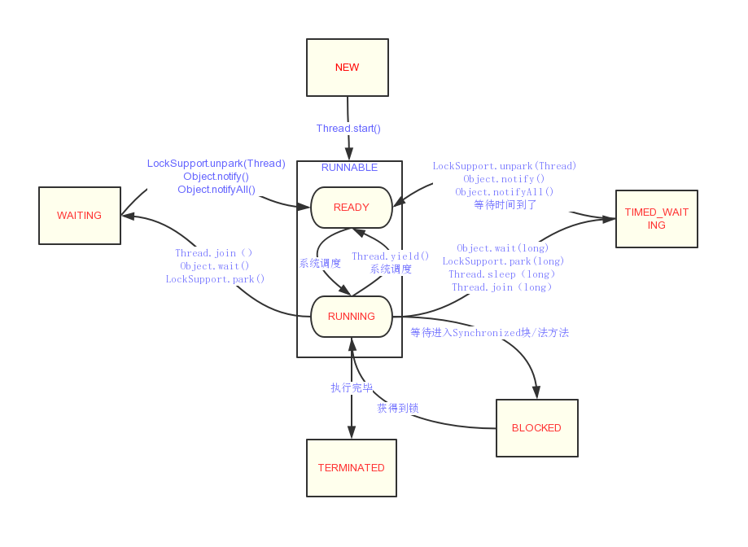

### 线程的状态
- 状态变换图
  - NEW:初始状态，线程被构建，但是还没有调用start()

  - RUNNABLE:运行状态，JAVA线程将操作系统中的**就绪**与**运行**两种状态笼统的称作运行中

  - BLOCKED:阻塞状态，表示线程阻塞于锁

  - WAITING:等待状态，表示线程进入等待状态，进入等待状态的线程需要其他线程做出一些特定动作(通知或中断)

  - TIMED_WAITING:超时等待状态，在WAITING的基础上在指定的时间到达之后自行返回

  - TERMINATED:终止状态，表示当前线程已经执行完毕


### 线程的中断
- 与线程中断相关的API
  - public void interrupt():打断当前线程，只是为interrupt flag设置为true，如果是个可以被打断的方法，会抛出一个InterruptException异常,**异常收到后interrupt标识会清除(变成false)**
  - public boolean isInterrupted():判断线程是否被打断(判断interrupt flag)
  - public static boolean interrupted():判断线程是否被打断(判断interrupt flag)并且会清除interrupt标识
- 可中断方法
  - 以下方法可以让线程进入阻塞状态，如果另外一个线程调用interrupt(),会打断这种阻塞
      - wait()/wait(long)
      - sleep(long)
      - join()/join(long)
      - InterruptibleChannel的IO
      - Selector的wakeup()
- 案例
``` java
        //这个案例比较特殊，就是我提起调用interrupt()，后面同样会收到中断信号，然后interrupt flag被复位
        System.out.println(Thread.currentThread().isInterrupted());
        Thread.currentThread().interrupt();

        System.out.println(Thread.currentThread().isInterrupted());
        try {
            Thread.sleep(2000);
        } catch (InterruptedException e) {
            e.printStackTrace();
            System.out.println("InterruptedException");
        }
```

``` java
// Thread.interrupted()判断是否线程被打断的同时会擦除interrupt标识
//结果会发现在多个false中有一个true出现
       Thread thread = new Thread(()->{
            while (true){
                System.out.println(Thread.interrupted());
            }
        },"thread1");
        thread.setDaemon(true);
        thread.start();
        try {
            Thread.sleep(2);
        } catch (InterruptedException e) {
            e.printStackTrace();
        }
        thread.interrupt();
```
(其他的部分比较好理解就不写了)