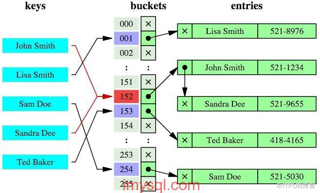
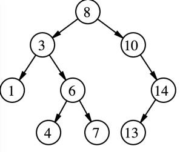

## 一.索引简介
索引是在**存储引擎**用于快速找到记录的一种数据结构。在数据量越来越大的时代，索引对性能的影响越来越严重。所以建立适当的索引非常重要，想要建立适当的索引，就需要深入索引的原理。

## 二.索引的优点
   我们最常用的就是Innodb的B+Tree索引，这里就说明这个索引的优点

1. 索引能大大减少服务器需要扫描的数据量
2. 索引能帮助服务器避免排序与建立临时表
3. 索引可以把随机I/O变成顺序I/O

## 三.索引的分类
    索引的类型有很多种，在Mysql中索引的在存贮引擎层实现的(这里基本只会拿Innodb的索引实现作为例子)。我这里根据个人的理解把索引从不同的角度进行对于索引进行划分。
- **按照存储结构进行划分**:按照存储时选用的数据结构不同
  - **BTREE**
  - **HASH**
  - **RTREE**
  - **FULLTEXT**
- 按照功能划分:
  - **普通索引(INDEX)**: 这是最基本的索引类型，而且它没有唯一性之类的限制。
  - **唯一索引(UNIQUE INDEX)**:索引列的值必须唯一，但允许有空值。如果是组合索引，则列值的组合必须唯一。
  - **主键索引(PRIMARY KEY)**:主键是一种唯一性索引，但它必须指定为“PRIMARY KEY”，且不允许有空值。
  - **全文索引(FULLTEXT INDEX)**:MySQL只有MyISAM存储引擎支持FULLTEXT索引，并且类类型为CHAR、TEXT、VARCHAR。
  - **组合索引**: 多列值组成一个索引，专门用于组合搜索，其效率大于索引合并
- 按照存储的方式(并不是所有的存储引擎都支持聚簇索引，Innodb支持):
  - 聚簇索引:将索引与数据放在一起，并且在叶子结点存放数据(在Innodb中主键索引就是聚簇索引)
  - 非聚簇索引:通过索引检索到行号，再通过行号找到数据（Innodb是找到对应的主键id，再通过主键id找到对应的数据）
## 四.索引的原理
#### 哈希索引
   - 哈希索引使用了哈希算法，把值通过哈希算法计算出哈希值进行定位。
    

   - 优点:
        1. 检索的时间复杂度理论上是O(1)，检索特别快
   - 缺点:
        1. 在数据量比较大的情况下，出现大量哈希碰撞，检索效率降低
        2. 不支持按照索引值的顺序存储，所以无法排序,无法进行范围查询
        3. 不知此最左匹配原则

#### BTree索引
   - 目前大部分数据库系统及文件系统都采用B-Tree或其变种B+Tree作为索引结构。

- 为什么选用BTree?

  1. 对于传统的二叉搜索树,当数据量比较大的时候，**树的高度就会非常高**，那么意味着I/O次数非常高，那么速度会很慢。
     
  2. 索引本身也很大，不可能全部存储在内存中，因此索引往往以索引文件的形式存储的磁盘上。磁盘一次读取为4K,因为磁盘预读功能，一次可以加载16k的数据。这样在BTree中一个节点就可以存放很多很多的索引的值，这样就可以大大减少树的高度，减少检索时的I/O次数
  3. MySQL的基本存储结构是页(记录都存在页里边)
     
  4. 在MyISAM与Innodb中的实现结构图
      - 在MyISAM数据与索引是分开存放的，不管是主键索引还是其他索引，都是存贮数据记录的磁盘地址   
      
         
           
      - 在Innobd中主键索引(也就是聚簇索引)与数据是存放在一起的，并且其他的二级索引中存放的是主键的值，再通过主键索引找到对应的数据   
      
         
         

### 五.问题解答(默认Innodb的B+Tree)
 - 经常在数据量很大的情况下我们要把主键用整数代替字符串，并且是增长的？
    1. 在使用BigInt的时候比UUID(为保证不重复一般都是UUID),占用的字节少，那么在B+Tree的结构中，就能存储更多的值。
    2. 比字符串好排序
    3. 如果你生成的是自增的（分布式id生成策略中都是增加的）,在插入时，就可以尽可能减少页分裂。

- 为什么我们经常被要求，只查询需要的字段？
    1. 在例如你查询只用到name时，select * from user where iphone=xxx，索引为（iphone，name）的时候，我们根据上面的innodb的索引结构学习到，你要查询索引中没有的字段的时候，需要先通过辅助索引找到主键索引的值，然后再找到对应的数据值（过程叫做回表），这样就多了I/O操作，如果你的sql改成select name from user where iphone=xxx，这个name值在辅助索引中已经有了，所以不需要再去主键索引中找数据，就提高了查询效率(这种情况叫做覆盖索引)。
- （一时记不起还有什么经常被说到的想到再添加）

