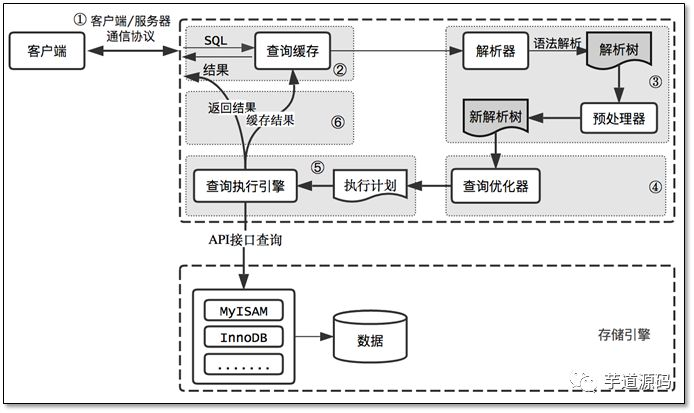
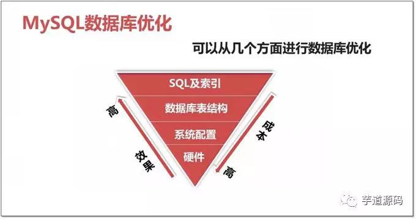
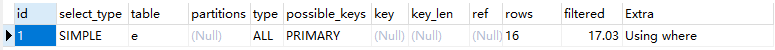

## 1.sql执行流程

> 在进行sql的优化之前必须要了解一下mysql的查询过程，很多查询的优化工作实际上就是遵循一些原则让mysql的优化器能偶按照预想的合理方式运行而已。



## 2.[MyISAM与InnoDB的对比](https://www.cnblogs.com/ijia/p/3826990.html)

## 3.sql优化

- **优化的原因** ：性能低、执行时间太长、等待时间太长、SQL语句欠佳（连接查询）、索引失效、服务器参数设置不合理（缓冲、线程数）

- **优化的维度** :硬件,系统配置，数据库表结构，sql及索引。

- **优化选择**：

  
- **解析**
```sql
编写过程：
select dinstinct  ..from  ..join ..on ..where ..group by ...having ..order by ..limit ..
解析过程：
from .. on.. join ..where ..group by ....having ...select dinstinct ..order by limit ...
```
- **索引**

  **SQL优化，主要就是在与优化索引**

  `索引相当于书的目录 index是帮助Mysql高效获取数据的数据结构。索引是数据结构（树：B树(默认)、Hash树...）`
  
|                             优势                             | 弊端                                                         |
| :----------------------------------------------------------: | :----------------------------------------------------------- |
|                 提高查询效率（降低IO使用率）                 | 索引会降低增删改的效率（增删改  查）                         |
| 降低CPU使用率 （...order by age desc,因为 B树索引 本身就是一个 好排序的结构，因此在排序时  可以直接使用） | 索引不是所有情况均适用： a.少量数据  b.频繁更新的字段   c.很少使用的字段 |
|                                                              | 索引本身很大， 可以存放在内存/硬盘（通常为 硬盘）            |

  `索引分类` ：

1. 主键索引  ：  不能重复。id    不能是null
2. 唯一索引  ：不能重复。id    可以是null
3. 单值（普通）索引  ： 单列， age ;一个表可以多个单值索引,name。
4. 复合（组合）索引  ：多个列构成的索引 （相当于 二级目录 ：  z: zhao）  (name,age)   (a,b,c,d,...,n)		

  `创建索引`：

1. 创建普通索引：

   create index 索引名称 on 表明（字段）| alter table 表名 add index 索引名称(字段) ;

2. 创建符合索引：

   create index 索引名称 on 表明（字段，字段...）|alter table 表名  add index 索引名称(字段,字段);

3. 创建唯一索引：

   create unique 索引名称 on 表明（字段）| alter table 表名 add unique 索引名称(字段) ;

`删除索引`：

   drop index 索引名 on 表名 ;

`查询索引`：

  show index from 表名 ;

- mysql执行计划分析

  `explain分析`：explain select * from xxx where xxxx=xxx

  


1.  **id** : 编号	

|          id值相同          |                           id值不同                           |
| :------------------------: | :----------------------------------------------------------: |
| d值相同，从上往下 顺序执行 | id值越大越优先查询 (本质：在嵌套子查询时，先查内层 再查外层) |

2.  **select_type** ：查询类型

|               PRIMARY               |               SUBQUERY                |             SIMPLE              |         DERIVED          |
| :---------------------------------: | :-----------------------------------: | :-----------------------------: | :----------------------: |
| 包含子查询SQL中的 主查询 （最外层） | 包含子查询SQL中的 子查询 （非最外层） | 简单查询（不包含子查询、union） | 衍生查询(使用到了临时表) |

3.  **table** ：输出结果集的表（表别名）

4.  **type**   ：访问类型。常见访问类型如下，从左到右，性能由好到最差，system>const>eq_ref>ref>range>index>all  （ref到range之间还有一些其他的不过不太常见）（**要对type进行优化的前提：有索引**）(**一般优化后的type必须在range以上**)

|                            system                            |                            const                             |                            eq_ref                            |                             ref                              |                            range                             |             index              | all                          |
| :----------------------------------------------------------: | :----------------------------------------------------------: | :----------------------------------------------------------: | :----------------------------------------------------------: | :----------------------------------------------------------: | :----------------------------: | ---------------------------- |
| 只有一条数据的系统表 ；或 衍生表只有一条数据的主查询（基本不能达到可忽略） | 仅仅能查到一条数据的SQL ,用于Primary key 或unique索引  （类型 与索引类型有关） | 唯一性索引：对于每个索引键的查询，返回匹配唯一行数据（有且只有1个，不能多 、不能0） | 非唯一性索引，对于每个索引键的查询，返回匹配的所有行（0，多） | 检索指定范围的行 ,where后面是一个范围查询(between   ,> < >=,     特殊:in有时候会失效 ，从而转为 无索引all) | 全索引扫描，查询全部索引中数据 | 全表扫描，查询全部表中的数据 |

5.  **possible_keys** ：可能用到的索引，是一种预测，不准。

6.  **key**  ：实际使用的索引

7.  **key_len** ：实际使用索引的长度 

     `作用`：用于判断复合索引是否被完全使用  （a,b,c）。 

    在utf8编码中：1个字符占3个字节，如果索引的字段可以为null，则会使用一个字节用来标识 ，如果是varchar这种，会用两个字节表示可变

   `例如` ：某个字段 name（varchar（20））,如果用到了这个字段的索引那么lenth就是 20*3+1（null）+2（可变字符） =63

8.  **ref**  :表之间的引用

   `作用` ： 指明当前表所 参照的 字段。（注意与type中的ref值的区别）

9.  **rows** ：被索引优化查询的 数据个数 (实际通过索引而查询到的 数据个数)

10.  **Extra**     :额外的信息

|                        using filesort                        |                    using temporary                     |                         using index                          |    using where     | impossible where     |
| :----------------------------------------------------------: | :----------------------------------------------------: | :----------------------------------------------------------: | :----------------: | -------------------- |
| 性能消耗大；需要“额外”的一次排序（查询）  。常见于 order by 语句中。 | 性能损耗大 ，用到了临时表。一般出现在group by 语句中。 | 性能提升; 索引覆盖（覆盖索引）。原因：不读取原文件，只从索引文件中获取数据 （不需要回表查询）只要使用到的列 全部都在索引中，就是索引覆盖using index | 表示进行了回表查询 | where子句永远为false |


- **sql索引优化原则小结**

  - 单表优化:
    1. 最佳左前缀，保持索引的定义和使用的顺序一致性 （index（a,b,c）,那么你的where语句的顺序最好也是a=x，b=x...，）
    2. 将含In的范围查询 放到where条件的最后，防止失效
  - 多表优化：
    1. 小表驱动大表  
    2. 索引建立在经常查询的字段上

  注意：优化时多用Explain进行执行分析，一步一步的进行优化，才能保证高效的sql语句

- **避免索引失效的一些原则**

  1. 复合索引，不能跨列使用（index（a，b，c），你的索引使用就不要 where a=x，c=x）

  2. 复合索引尽量使用全索引匹配

  3. 不要在索引上进行任何操作（计算，函数，类型转换），否则索引失效

  4. 复合索引不要使用不等（！= ,<>，>），这样会导致自身以及右侧的索引失效**(这个不是一定的有概率的**)

  5.  like尽量以“常量”开头，不要以'%'开头，否则索引失效

  6.  尽量不要使用or，否则索引失效（字段都是单值索引是可以的）


