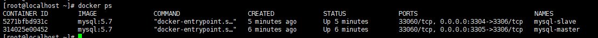
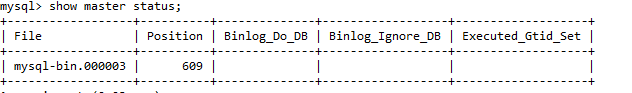
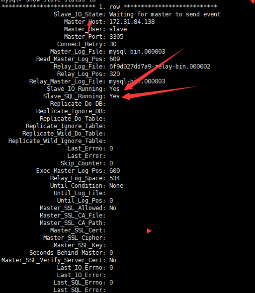

##### 为什么要基于docker搭建mysql的主从复制

- 穷没有钱，只有一个机器资源很宝贵

- 一个一个搭建mysql很麻烦

- docker的隔离性非常好

- 可以秒级启动好几个mysql

##### 搭建主从Mysql

```bash
考虑到mysql目前5.7是主流版本，本次搭建使用5.7版本的mysql
```

- 拉取Docker image: `docker pull mysql:5.7`

- 启动容器主从两个mysql容器，对外 **主:3305**，**从:3304**：

1. 为主从分别准备一下他自己的my.cnf文件，如果不知道的可以自行百度查询my.cnf里面主从设置
2. `docker run --name mysql-master -p 3305:3306 -v /root/master/my.cnf:/etc/mysql/my.cnf -e MYSQL_ROOT_PASSWORD=123456 -d mysql:5.7 --character-set-server=utf8mb4 --collation-server=utf8mb4_unicode_ci`
3. `docker run --name mysql-slave -p 3304:3306 -v /root/slave/my.cnf:/etc/mysql/my.cnf -e MYSQL_ROOT_PASSWORD=123456 -d mysql:5.7 --character-set-server=utf8mb4 --collation-server=utf8mb4_unicode_ci`

- 查看一下当前启动的Mysql容器，用Navicat链接一下确保没有问题



- 进入mysql进行配置主从

   1. 创建用来主从复制的用户：`CREATE USER 'slave'@'%' IDENTIFIED BY '123456';`   

   2. 授权用户：`GRANT REPLICATION SLAVE, REPLICATION CLIENT ON *.* TO 'slave'@'%';`

   3. 查询当前master的状态：`show master status;`

      

   4. 进入slave mysql执行: `change master to master_host='172.31.84.138', master_user='slave', master_password='123456', master_port=3305, master_log_file='mysql-bin.000003', master_log_pos= 609, master_connect_retry=30;`

   5.  开启slave模式：`start slave;`

   6. 查看确保主从成功：show slave status \G

      

- 参考文章
  1. [docker官方仓库mysql容器部署描述](https://hub.docker.com/_/mysql?tab=description)

