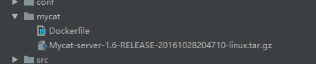
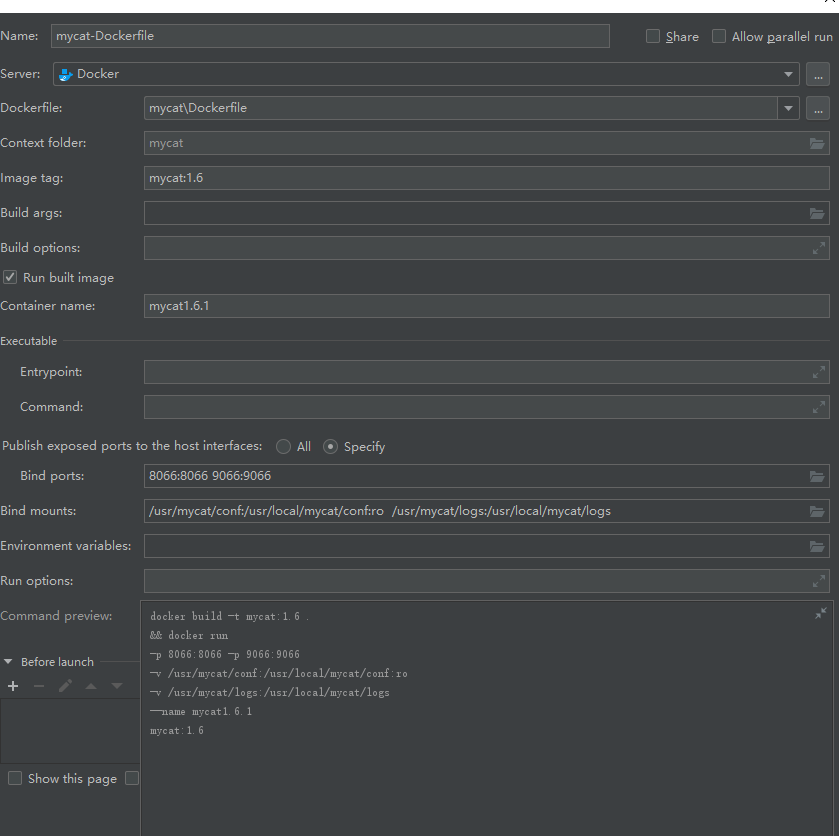

- 依赖于已经搭建好的mysql的主从配置，[相关可以点击参考](./基于Docker的mysql主从搭建.md)

- 下载好mycat的文件（这里选择的mycat 1.6版本的）

  

- 将自己配置好的逻辑的schema.xml,rule.xml,log4j2.xml,server.xml放到服务器中自定义的文件夹（例如：/usr/mycat/conf）

- 构建dockerfile

```docker
FROM java:8
COPY ./Mycat-server-1.6-RELEASE-20161028204710-linux.tar.gz /usr/local/mycat-server.tar.gz
RUN cd /usr/local && tar -zxvf mycat-server.tar.gz && ls -lna
EXPOSE 8066 9066
CMD ["/usr/local/mycat/bin/mycat", "console"]
```

