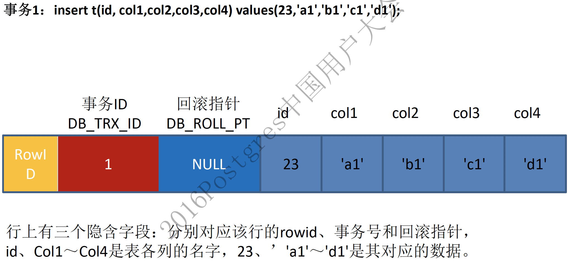
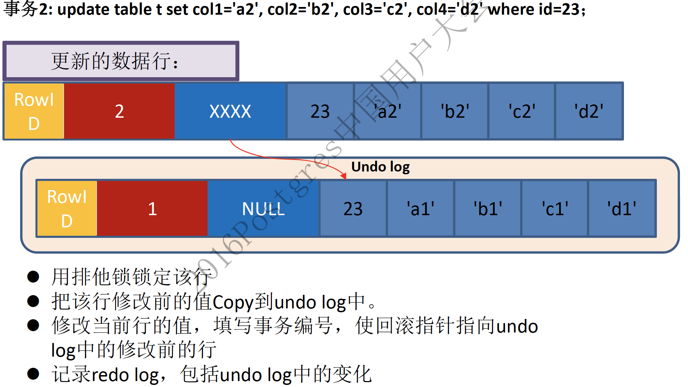

## MySQL锁
#### 一.什么是锁？
 - 锁是用于管理不同事务对共享资源的并发访问
#### 二.MySQL锁有哪些？
 - **按照锁的粒度划分**
    - 行锁:目前只有Innodb支持行锁，是利用索引实现的(所以在使用更新的时候没有使用到索引，就会锁表)
    - 表锁

    |    |  行锁  | 表锁 |
    |---|:---:|:---:|
    | 锁定粒度   | 记录或者区间|全表  |
    |加锁效率    | 慢   |快     |
    |冲突概率    | 低   | 高  |
    |并发性能   | 高   | 低  |
- **按照锁的类型划分**
    - **共享锁(Shared Locks)-行锁**:
       - 简介:又叫做读锁，简称S锁。在多个事务共同对同一数据可以共享一把锁，都可以访问到数据，但是不能修改数据;
       - 加锁方式 : select * from xxx where id =x LOCK IN SHARE MODE;
    - **排他锁(Exclusive Locks)-行锁**:
       - 简介:又叫做写锁，简称X锁。不能与其他事务共享，只有获得锁的事务才能对数据进行读取去修改
       - 加锁方式 : delete/update/insert默认加上X锁，查询:select * from xxx where id =x for update;
    - **意向共享锁(Intention Shared Locks)-表锁**:
       - 简介:简称IS锁，在事务准备给数据加共享锁之前，需要去获取表的IS锁，意向共享锁之间可以互相兼容
    - **意向排他锁(Intention Exclusive Locks)-表锁**:
       - 简介:简称IX锁，在事务准备给数据加排他锁之前，需要去获取表的IX锁，意向排他锁之间可以互相兼容
    `(意向锁是由Innodb自动加的，无法干预，它存在的意义在于，当你进行锁表操作时，如果发现意向锁已经被拿了，那么你需要等到锁的释放才能进行锁表)`
- **按照锁的实现**:
    - **记录锁(Record locks)**:锁住具体的索引项，当sql执行按照唯一索引进行数据检索的时候，查询条件等值匹配的时候并且数据存在的时候，这个sql加上的就是记录锁。
    - **间隙锁(Gap locks)**:锁住数据不存在的区间(左开右闭(}),在sq执行按照索引进行数据检索的时候，查询数据不存在，这时SQL加上的锁为间隙锁，锁住了不存在的区间。
    - **淋键锁(Next-key locks)**:等于(Record locks+Gap locks)(左开右闭(})，当sql执行按照索引进行数据检索时，查询条件为范围查找，并有数据命中，这个sql语句加上的锁就是临键锁，锁住记录+区间（**这个锁解决了幻读问题**）

### Mysql的MVCC
#### 一.什么是MVCC？
- 全称为Multiversion concurrency control(多版本并发控制),在查询时替代行锁，降低开销，为事务RC,RR隔离级别下的一致性读提供保障。

#### 二.什么是一致性读？
- **一致性非锁定读(快照读)**:不主动加锁的select语句就是快照读，读取的是数据的快照版本。innodb快照读，数据的兑取由cache(原本数据)与undo(当前事务修改或者插入之前的数据)两部分组成
 (在不同的隔离级别下，快照读是有区别的，在RC下，每次读取都会重新生成一个快照，所以每次快照都是最新的，也因此事务中每次select也可以看到其他事务commit的数据的更改，也就是不可重复读。但是在RR级别下，快照会在事务中第一次select语句执行时生成，只有在本事务中对数据修改才会更新快照，因此，只能看到第一次select之前已经提交事务的数据)
- **一致性锁定读(当前读)**：sql读取的数据时最新版本的。通过锁机制在保证数据无法通过其他事务进行修改。除了普通的select其他的都是当前读。

#### 三.MVCC的实现
- 在innodb中除了我们自己创建的字段之外，还存储着额外的字段DATA_TRX_ID，DATA_ROLL_PTR，DB_ROW_ID，DELETE BIT
   - **DATA_TRX_ID**:标记了最新更新这条行记录的transaction id，每处理一个事务，其值自动+1
   - **DATA_ROLL_PTR**:指向当前记录项的rollback segment的undo log记录，找之前版本的数据就是通过这个指针
   - **DB_ROW_ID**:当由innodb自动产生聚集索引时，聚集索引包括这个DB_ROW_ID的值，否则聚集索引中不包括这个值.，这个用于索引当中
   - **DELETE BIT**:位用于标识该记录是否被删除，这里的不是真正的删除数据，而是标志出来的删除。真正意义的删除是在commit的时候

- InnoDB的MVCC，是通过在每行纪录后面保存两个隐藏的列来实现的。这两个列，一个保存了行的创建时间(DATA_TRX_ID)，一个保存了行的删除时间(DELETE BIT)，当然存储的并不是实际的时间值，而是系统版本号。每开始一个新的事务，系统版本号都会自动递增。事务开始时刻的系统版本号会作为事务的版本号，用来和查询到的每行纪录的版本号进行比较。
  - 在REPEATABLE READ隔离级别下，SELECT InnoDB会根据以下两个条件检查每行纪录:
       1. InnoDB只查找版本早于当前事务版本的数据行，即，行的系统版本号小于或等于事务的系统版本号，这样可以确保事务读取的行，要么是在事务开始前已经存在的，要么是事务自身插入或者修改过的。
       2. 行的删除版本，要么未定义，要么大于当前事务版本号。这样可以确保事务读取到的行，在事务开始之前未被删除。

- **注意**:MVCC只是解决看可重复读的问题(上面提到的在RR级别下快照读只有一份)，但是还是会出现幻读的(例如事务A插入一条数据,事务B范围查询，事务A提交事务，事务B普通查询因为查询的是快照，所以查询不到数据，但是加锁的情况下会进行当前读，读取到了数据，产生了幻读，所以想避免幻读，必须使用临键锁)
