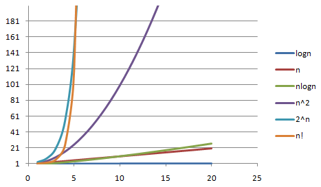

### 大O复杂度表示法

- 公式：**T(n)=O(f(n))**

1. T(n) : 执行时间

2. n : 数据规模的大小
3. f(n) ：代表每行代码执行次数的总和

```java
例1 
int cal(int n) {
   int sum = 0;
   int i = 1;
   int j = 1;
   for (; i <= n; ++i) {
     j = 1;
     for (; j <= n; ++j) {
       sum = sum +  i * j;
     }
   }
 }
T(n) = O(2n^2+2n+3)：
```


### 时间复杂度分析

#### 概念

- **时间复杂度概念**：全称是渐进时间复杂度，表示算法的执行时间与数据规模之间的增长关系。
- **最好情况时间复杂度**（best case time complexity):在理想情况下代码的时间复杂度
- **最坏情况时间复杂度**（worst case time complexity):在最糟糕的情况下，执行这段代码的时间复杂度

> 当n很大时候，公式中的低阶，常量，系数三部分并不能左右增长趋势，所以都可以忽略。我们只需要记录一个最大量级就行了，如果用大O表示法就可以变成T(n)=O(n^2)

### 实用的分析手法

1. **只关注循环执行次数最多的一段代码**:我们在分析一个算法，一段代码的时间复杂度的时候，也只关注循环执行次数最多的那一段代码就可以了

2. **加法法则**：总复杂度等于量级最大的那段代码的复杂度

3. **乘法法则**：嵌套代码的复杂度等于嵌套内外代码复杂度的乘积

```java
int cal(int n) {
   int ret = 0; 
   int i = 1;
   for (; i < n; ++i) {
     ret = ret + f(i);
   } 
 } 
 
 int f(int n) {
  int sum = 0;  int i = 1;
  for (; i < n; ++i) {
    sum = sum + i;
  } 
  return sum;
 }
 乘法法则案例
```



### 空间复杂度分析

- **空间复杂度概念**：全称是渐进空间复杂度，表示算法的存储空间与数据规模之间的增长关系。

```java
void print(int n) {
  int i = 0;
  int[] a = new int[n];
  for (i; i <n; ++i) {
    a[i] = i * i;
  }

  for (i = n-1; i >= 0; --i) {
    print out a[i]
  }
}

```

> 上例中只会根据n分配一个空间大小为n的int类型的数组，其他的代码并不占用其他空间，所以空间复杂度就是O(n),空间复杂度一般就是O(1)、O(n)、O(n2 )，其他的基本上见不到

