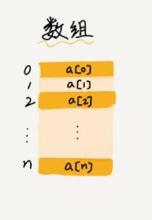
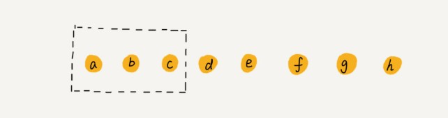

#### 数组的基本概念
- 数组(Array)是一种线性表数据结构。它用一组连续的内存空间，来存储一组具有相同类型的数据。
 1. 线性表结构，如下图数据排成一条线一样的结构
 
 
 
 2.连续的内存空间和相同类型的数据，具有`随机访问`的特性，这也限制了数组的其它操作会很低效，在进行随机插入与删除时，需要做大量的数据搬移。
 
 
  
  
##### 数组在标记删除中的使用:
  在上图中我们想删除a,b,c三个元素，为了避免后面的元素在每次删除的时候都搬移，所以我们可以先把已经删除的数据标记起来，当存储空间不足的时候进行真正的删除，这也是JVM中标记算法的核心思想
 
    
 
 
 