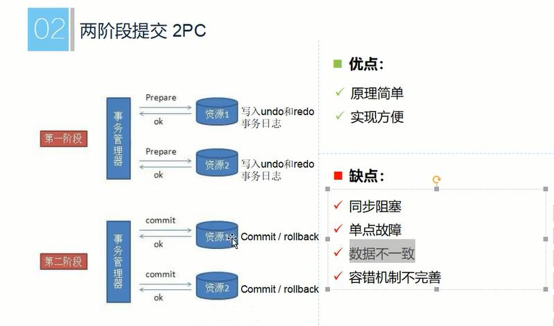
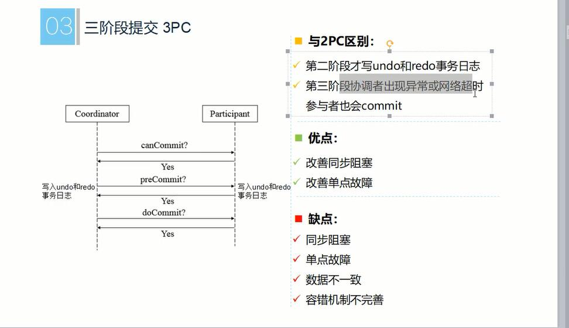
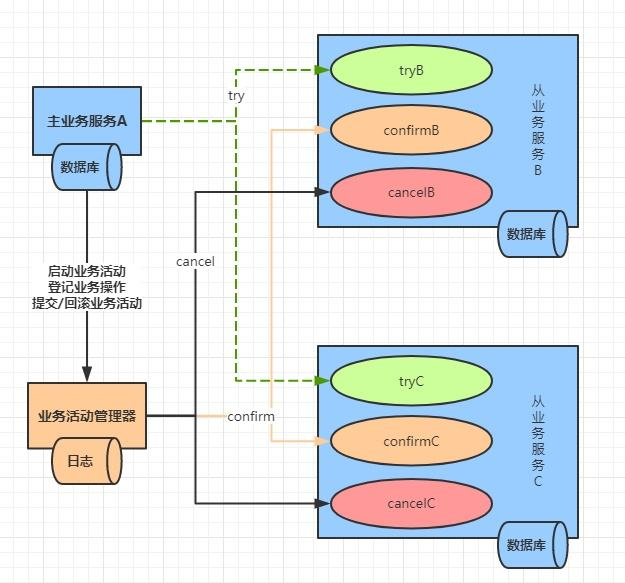
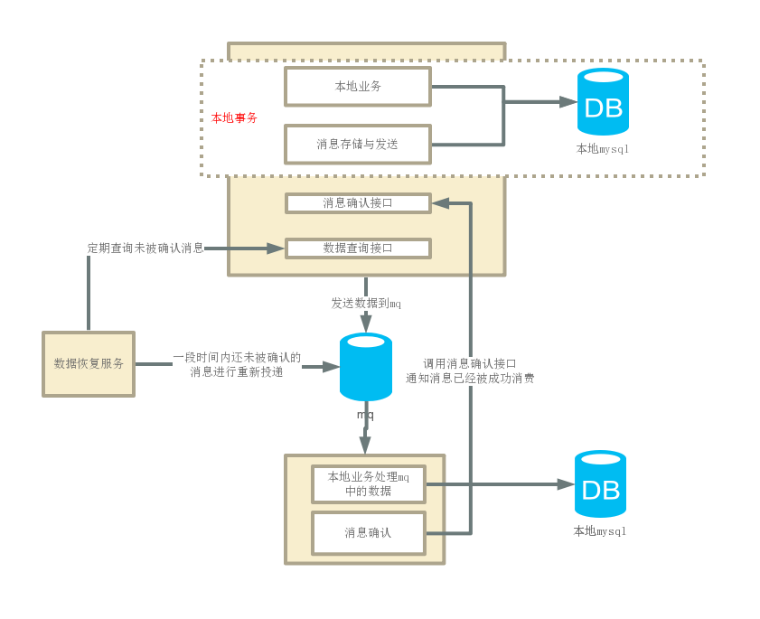

### 什么是分布式事务？
`在分布式系统中，多个服务之间使用独立的数据库，分布式事务就是为了保证不同数据库的一致性。也就是说原来的一个本地事务在分布式中被分成了多个本地事务。分布式事务通过事务管理器对于这多个事务进行管理，要么全部成功要么全部失败`

### 分布式事务的基础
#### 一.在谈分布式事务之前，先谈谈我们经常使用的本地事务。

>在本地事务中,事务的四大特性大家都知道，
> A(Atomicity)原子性
> C(Consistency)一致性
> I(Isolation)隔离性
> D(Durability)隔离性
> 但是数据库（以mysql为例）是如何保证这些的,我们必须先弄清楚以下几个问题

   1. 本地事务中mysql是如何保证数据一致性的?

   >  在事务的特性中，C是目的，AID是手段，通过AID我们得到的C(这个前提是应用层代码不违反约定，例如A转账给B，但是你代码不给B加钱，那么一致性也不会达到)

   2. mysql本地事务是如何保证原子性的？

   > 通过innodb的undo log(回滚日志),当我们delete，update，insert时，会生成一条undo log日志，记录了回滚这个操作需要的信息，当事务rollback的时候就可以通过undo log里面的信息进行数据回滚。

   3. mysql是如何保证持久性的?

   >  通过innodb的redo log(恢复日志)，每次事务提交后会把log file写入到os buffer中，再由os写入到disk中,来保证数据的持久性。

   4. mysql如何保证隔离性？
   > 通过锁与MVCC机制保证隔离性

`对于mysql的innodb引擎，redo log，undo log，锁，MVCC这些想深入了解的可以去看看其他文章`

#### 二.在分布式中跨多个数据库，显然无法像单数据库这种保证ACID，所以提出了另外一种理论
 - BASE理论
   - BA:Basic Availability基本业务可用性(支持分区失败)
   - S:Soft state 柔性状态(状态允许有段时间不同步，异步)
   - E:Eventual consistency 最终一致性(最终数据是一致的，但不是实时一致)
 - 从Base里面种可以看出，在分布式中，我们对于ACID里面做出了妥协(ACID-BASE Balance)
   1. 原子性与持久性在BASE中还是必须要作为根本保障
   2. 为了可用性与性能，降级服务的需要，我们只能降低一致性与隔离性的要求
   3. 最终达到数据一致性即可
### 分布式事务有哪些解决方案?

#### 1.刚性事务-XA方案
    XA方案的两种实现:
   - 2PC
    
   - 3PC
    
[两阶段提交协议、三阶提交协议说明](https://www.hollischuang.com/archives/681)
[深入2PC与3PC](https://www.hollischuang.com/archives/1580)

#### 2.柔性事务-TCC方案(两阶段，补偿型)
  > TCC其实也是2PC的一种，只不过TCC是在业务层进行控制，XA的2PC是在资源层进行控制

   - **Try**: 尝试执行业务
       - 完成所有业务检查（一致性）
       - 预留必须业务资源（准隔离性）
   - **Confirm**: 确认执行业务；
       - 真正执行业务，不作任何业务检查
       - 只使用Try阶段预留的业务资源
       - Confirm 操作满足幂等性
   - **Cancel**: 取消执行业务
       - 释放Try阶段预留的业务资源
       - Cancel操作满足幂等性

  
 - **优点**: 三个阶段都是独立的事务，能很好的控制锁的粒度，不会像XA一样把资源挂起，提高的吞吐量
 - **缺点**: 与具体的业务偶合，每个业务需要些三个方法，try，confirm，cancel，开发成本大
 - **使用场景**: 需要对前置资源锁定，数据一致性严格的场景，如需要扣除的积分啊，库存啊

这三个阶段，都会按本地事务的方式执行。不同于 XA的prepare ，TCC 无需将 XA 的投票期间的所有资源挂起，因此极大的提高了吞吐量。
#### 3.柔性事务-可靠消息最终一致性方案(异步确保)
   - 本地消息表
     
     该模式通过把业务数据与需要远程处理的数据放到一个事务中，存贮在本地，通过MQ发送，下游处理完毕后进行回调修改存储的数据状态，达到异步确保型
      - 优点:实现比较简单，消息的实时性比较高
      - 缺点: 与业务场景绑定，耦合性高，
   - 基于MQ事物(这个目前RocketMQ消息事物不熟悉，Kafka的还有一点疑问以后补充)

#### 4.柔性事务-最大努力通知(定期校验)
  
- 特点
    - 在业务活动的主动方，在完成业务处理之后，向业务活动的被动方发送消息，允许消息丢失
    - 业务活动的主动方通过定时策略，在通知失败后按照规则重复通知，直到通知N次后不再通知
    - 主动方提供查询接口给被动方校对查询，用于恢复丢失的业务消息(补偿)

- 使用场景:跨企业通知(如短信通知，支付结果通知)

