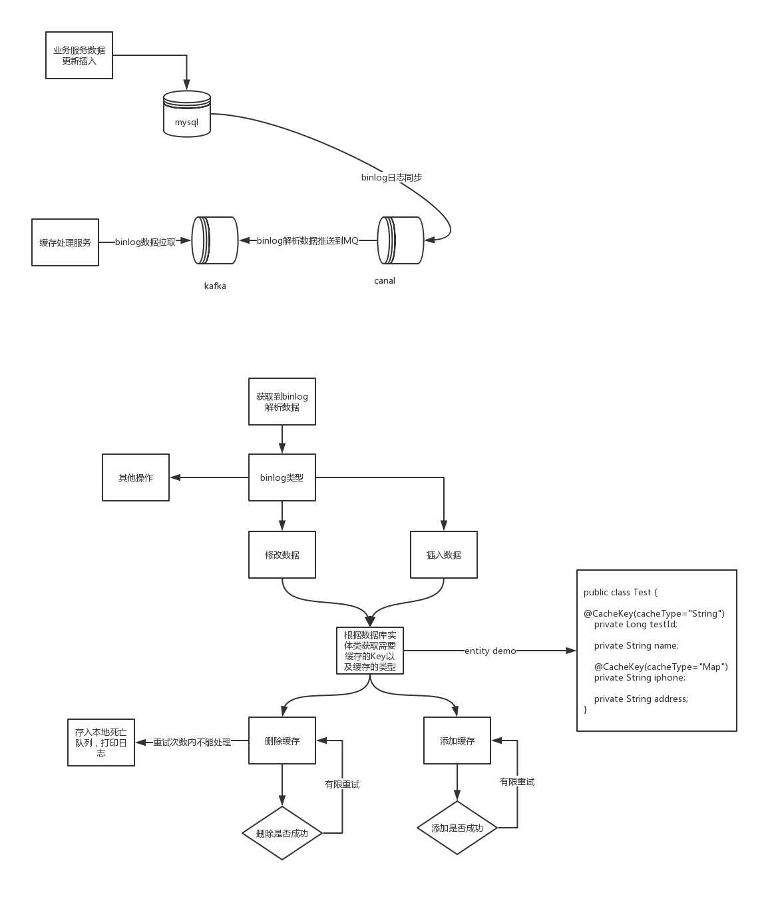

#### 一.背景介绍
为了提高系统的读的性能，都会引入缓存，那么如何保证缓存与数据库中数据的一致性。
#### 二.缓存一致性方案讨论
- 数据不一致的情况
     1. **数据库有数据，缓存没有数据**

     2. **数据库没有数据，缓存有数据**

     3. **数据库有数据，缓存有数据，但是数据不一致**

- 缓存更新策略
  1. **先更新缓存，再更新数据库**

  2. **先更新数据库，再更新缓存**

  3. **先删除缓存，再更新数据库**

  4. **先更新数据库，再删除缓存**
- 更新策略可行性分析
  - 策略一:第一种方案估计是没人会使用的，db回滚太正常不过，所以第一种方案肯定最先排除

  - 策略二:不可行，从下面两个角度考虑
       - 从并发角度考虑:A请求先修改了数据，B请求后修改同样的数据，但是B先更新了缓存，再A更新缓存，这种情况下会出现数据不一致
       - 从业务角度考虑:如果你的写请求这么频繁，那么缓存的意义并不大，我们还需要经过计算后再写入缓存与数据库，所以删除缓存更加合适。
  - 策略三:
      - 从并发的角度任然存在问题，当A请求删除了缓存，但是没有更新，请求B查询数据库，把老值查询出来放入的缓存中，A更新了数据库，这种情况下就会出现数据不一致的问题。

  - 策略四:
      - 从并发的角度也是有一点问题的，当缓存失效时,我们去A请求查询数据，B请求更新数据，A没有命中缓存，查询到了老的数据，B请求更新好数据后删除缓存，然后B再把老的数据更新到了缓存中，但是我们可以思考一下，这种概率是非常低的，首先数据库的读操作时要比写操作快很多，并且这种情况还发送在刚好缓存失效是并发了一个读写请求。
- 简单分析，四种策略中策略四是看来是最好的。其实这个也是FaceBook提出的<Cache-Aside pattern>,其中提出了
   - **失效**:应用程序先从cache取数据，没有得到，则从数据库中取数据，成功后，放到缓存中。
     
   - **命中**:应用程序从cache中取数据，取到后返回。
   
   - **更新**:先把数据存到数据库中，成功后，再让缓存失效。
#### 三.实际方案
 - 在上面的讨论中我们也知道策略四是看起来最好的一个，但是在项目中使用这种就好了吗？实际上还是存在两个问题
    1. 会存在删除缓存失败的问题
    2. 在实际场景中，我们做了主从，主从一般存在一点延迟，在数据更新的情况下来了一个请求查询到未同步的从库，就会导致缓存中存在的是老数据，并且这种概率比较大。
 - 处理上面问题的方案：对于第一个问题，那么我们需要一个失败重试的队列。对于第二个问题，那么我们需要延迟删除缓存，最好是等到从库同步后删除。当前我采用的方案如下([canal binlog日志同步](https://github.com/alibaba/canal))

- **总结**:当然对于上面的方案，有可能重试也失败，同时canal拿到数据删除缓存时，可能另外一个从数据库晚了一点，导致查询请求把老值放入缓存中。当然经过这么多的保证，数据出现不一致的概率已经非常非常低了。同时我们设置了过期时间。这样即使出现了，最终也会过期。
