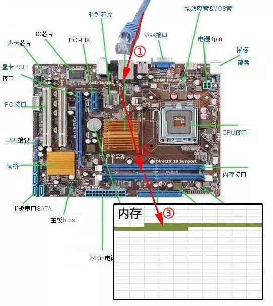
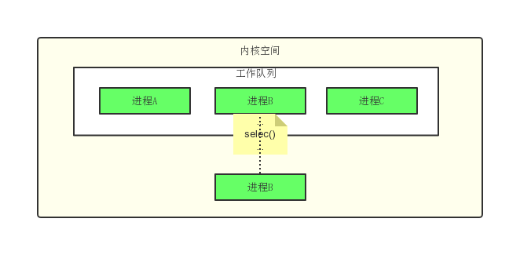
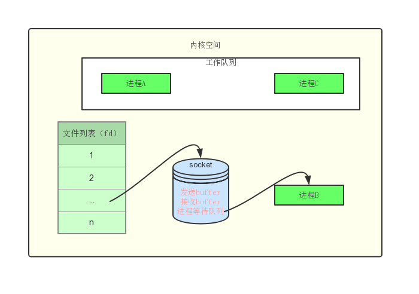
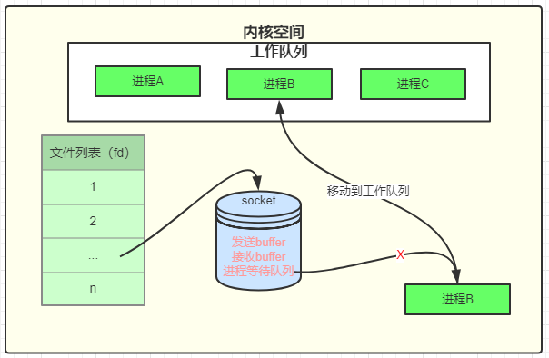
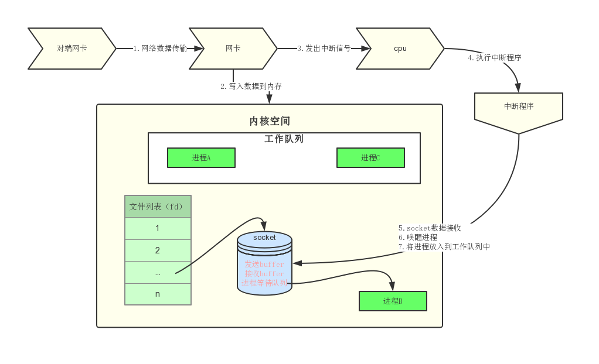
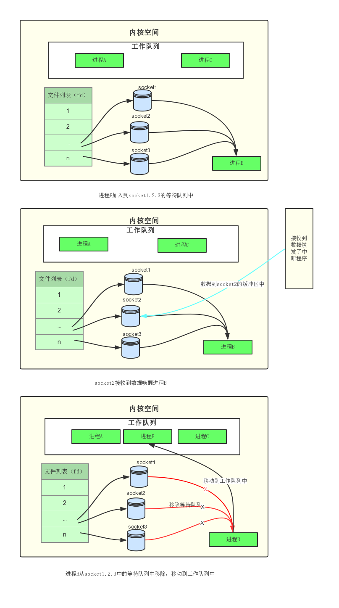
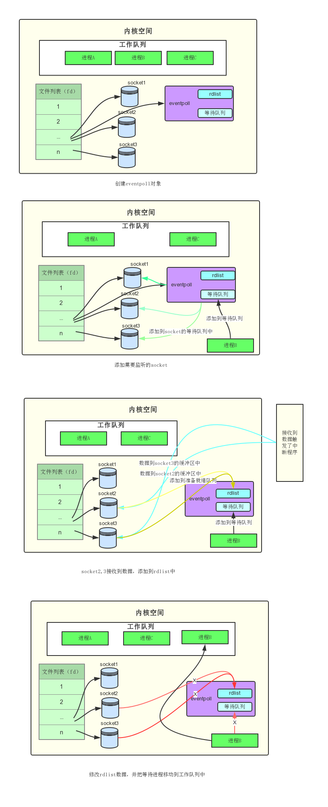

## 一篇文章明白为什么Epoll性能好
#### 一.从网卡接收数据说起
- 接收数据的过程
  1. 网卡收到网线传输过来的数据
  2. 通过硬件电路传输
  3. 最后将数据写入到内存中的某个地址中
  
#### 二.如何知道接收到数据
>cpu中有一个重要的概念-**中断**。
> 在计算机执行程序时会有优先级的需求。一般对于硬件产生的信号cpu需要立马做出回应，防止数据丢失。cpu需要中断正在执行的程序，做出响应，当cup完成了对于硬件的响应后，再重新执行用户的程序。

所以在当网卡把数据写入到内存之后，网卡会向cpu发出一个中断信号，这个时候操作系统就知道数据已经到了。再通过网卡中断程序去处理数据。
#### 三.进程阻塞为什么不占用cpu资源
`一次网络数据接收涉及到的重要概念`
- **阻塞**:阻塞指的是进程在等待某件事（这里指的就是网络数据）发生之前的等待状态，select和epoll都是阻塞方法。在我们进行网络编程的时候，当我们执行到select()的时候就阻塞住了，他会一直等到收到数据才往下执行。
- **工作队列**:操作系统是支持多任务，实现了进程任务调度的,当进程获取到的cpu的使用权，就会进入正在执行状态。当进程阻塞时就进入了等待状态。操作系统会分时执行个个运行状态的进程，由于速度非常快，所以看起来就像同时执行多个任务一样。下图中B进程执行到select()等待网络数据的到来就会从工作队列中移除.
   
- **等待队列**:当进程B执行到select()的时候就被移动到由文件系统管理的socket对象的等待队列中，这时工作队列中只有AC两个进程，cpu就会轮流执行这两个进程，B进程就不会占用cpu的资源。操作系统添加等待队列只是添加了对这个等待中进程的引用，以便在接收到数据时获取进程对象，将其唤醒，并不是进行管理。

- **进程唤醒**:在socket接收到网络传输过来的数据后，操作系统讲原来socket想的等待进程重新放回到工作队列中，进程由等待状态转换成运行状态，这个时候数据已经准备好了，所以程序可以直接获取到接收到的数据。

#### 四.内核接收网络数据的全过程
1. 计算机接收网络传输的数据
2. 数据由网卡传送到内存中
3. 网卡通过中断程序通知cpu有数据到达，cpu执行中断程序
4. 中断程序将网络数据写入到socket的接收缓冲区中，并且唤醒等待队列中进程
5. 将唤醒的进程放入到工作队列中

#### 五.同时监视多个socket
select的设计思想就是，当列表中的socket都没有数据时，就把进程挂机，直到有一个socket收到数据就唤醒进程。
- select的流程

>在经过上诉流程之后进程B执行时，他知道此时知道有一个socket的数据是准备就绪的，这时程序就需要遍历一遍socket的列表，可以获取到准备就绪的socket
- select的缺点
1. 每次调用select()是都需要将进程加入到所有监视的socket的等待队列中，当有socket的数据准备好时又要从每个等待队列中删除。这里就有两次遍历了,每次都需要将所有的fds列表传递给内核，数量大是开销大，这也就是为什么select的最大监视数量默认情况下是1024个。
2. 进程被唤醒之后程序不知道那个socket的数据准备好了，所以这里需要进行遍历一遍。
   >只解释了select的一种情形。当程序调用select时，内核会先遍历一遍socket，如果有一个以上的socket接收缓冲区有数据，那么select直接返回，不会阻塞。这也是为什么select的返回值有可能大于1的原因之一。如果没有socket有数据，进程才会阻塞。
#### 六.epoll的设计思路
- epoll流程
  1. 创建epoll对象，也是文件系统中的一员，与socket一样也有等待队列
  2. 内核把eventpoll添加到需要监听的socket的等待队列中
  3. 收到程序后中断程序把准备好数据的socket加入到rdlist队列中
  4. 阻塞程序会被放到eventpoll的等待队列中，当数据准备好后，唤醒进程，对于rdlist中准备好的socket进行遍历数据处理

[参考文章](https://www.toutiao.com/a6683264188703310340/)

