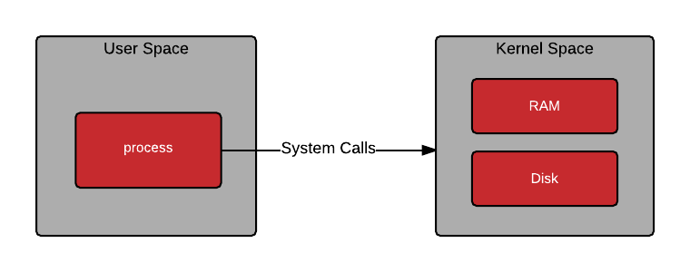
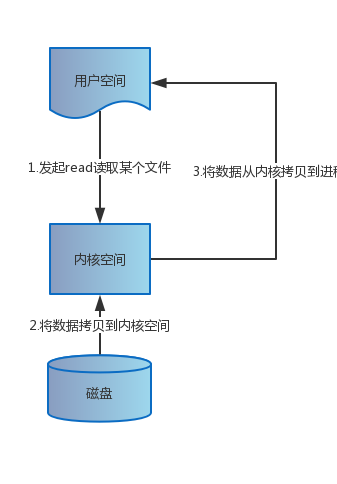
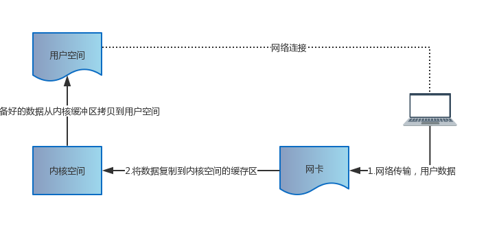
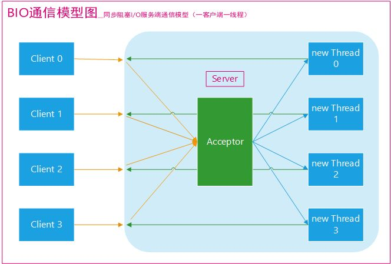
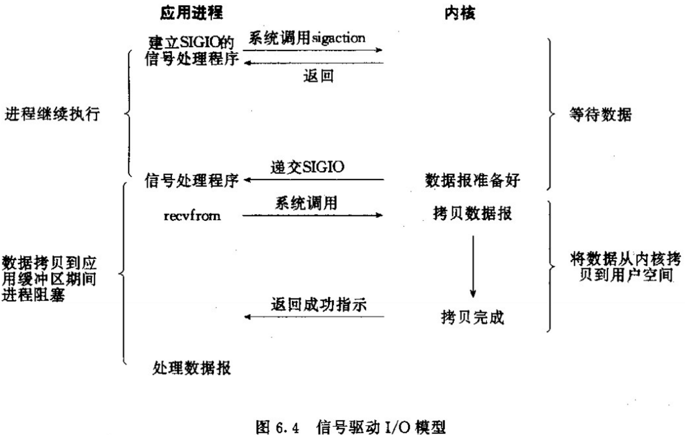

## 一.其他概念简述  
 ### 1.1 **用户空间与内核空间**
  

```
Kernel Space就是内核空间，也就是Linux内核的运行空间。用户空间就是程序运行的空间(例如一个Java应用程序运行的空间)。这样分离保证了内核的安全性，用户程序的崩溃不会影响到内核
```

 ### 1.2进程切换（很消耗资源）

```
为了控制进程的执行，内核必须有能力挂起正在CPU上运行的进程，并恢复以前挂起的某个进程的执行。这种行为被称为进程切换。
```

### 1.3文件描述符（File Descriptor）

```
Linux的内核将所有的外部设备都看成了一个文件来操作，对于每个文件的读写操作都会用系统系统命令来返回一个File Descriptor(Socket的读写也有相应的描述，称为Socketfd)
```

### 1.4缓存IO

```
缓存IO又称为标准IO，大多数文件系统的默认IO操作都是缓存IO。在Linux的缓存IO机制中，缓存系统会将IO的数据缓存在文件系统的页缓存中，也就是说，数据会先被拷贝到操作系统内核的缓冲区中，然后再由操作系统内核缓冲区拷贝到应用程序的地址空间
```

### 1.5 select(),poll(),epoll()

- **select()与poll()**：

  ```
  两个没什么区别,两则简单而言就是都负责对于读，写，接入事件的注册，并在用户进程调用函数时返回交由内核监听的Socket中已经准备就绪的的socketfd,通知用户进程
  ```


- **epoll**()：是在select(),poll()进行的改进，改进点如下

   ```
     1. 避免了select()在一个进程打开socketfd的数量的限制（1024）
     
     2. IO的效率不会随着FD的数目的增长而线性下降：
        当socketfd集合很大的时候在每次执行select函数时其实只有很少的socket处于活跃状态，但是select()会全集合扫描，导致性能下降。但是epoll()只对活跃的socket进行操作所以不会有这个问题
     
     3. 利用mmap共享内存避免了内核到用户空间之间的拷贝
   ```

    

##  二.Linux IO模型

- **文件IO**

 

- **网络IO**（网络IO的本质是Socket的读取，Socket在Linux系统中抽象为流，IO可以理解外对流的操作 ）

 

#### 五种IO模型

- **阻塞I/O模型**

  - 网络模型

    

  - 通讯模型：每个连接一个线程用来处理通讯

    

    

  - 流程简介：

    1. 数据准备阶段：例如网络IO传输的数据，等待数据拷贝到内核的过程中，**用户进程阻塞**
    2. 复制阶段：内核接受到的数据拷贝到用户进程，**用户进程阻塞**

  - 优点

    1. 能及时返回数据，无延迟
    2. 对内核开发而言开发容易

  - 缺点：

    1. 对用户来说需要等待从而性能很低

- **同步非阻塞IO模型**

  - 网络模型

    

  - 流程简述

    1. 数据准备阶段：例如网络IO传输的数据，用户进程反复进行系统调用，如果数据没有准备好就返回error（轮询），一直到内核数据准备就绪。**用户进程不阻塞**
    2. 复制阶段：内核接受到的数据拷贝到用户进程，**用户进程阻塞**

  - 优点：理论上可以再等待期间去做其它的事情了

  - 缺点：任务完成延迟增大，最大可能相差一次轮询的时间，降低系统吞吐量

- **IO多路复用**

  - 网络模型

    

  - 流程简述:

    1.  数据准备阶段：进程在select()或pool()注册了读事件后，网络数据传输过来后，将数据拷贝靠内核空间，用户在调用select()时会阻塞一直等到有已经准备好的数据提供给我拷贝到用户空间，并返回已经准备好数据的FD，交由用户进程处理，其实这里也是阻塞，只不过是阻塞在select()上，select同时可以处理很多个注册在上面的IO操作。
    2. 复制阶段：内核接受到的数据拷贝到用户进程，**用户进程阻塞**

  - 优点：同时可以处理很多个Socket

  - 缺点：第一阶段与第二阶段还是会阻塞

- **信号驱动IO模型**：

  - 网络模型

    

  - 流程简述

    首先我们允许Socket进行信号驱动IO,并安装一个信号处理函数，进程继续运行并不阻塞。当数据准备好时，进程会收到一个SIGIO信号，可以在信号处理函数中调用I/O操作函数处理数据

- **异步IO模型**

  - 网络模型

    

  - 流程简述

    用户进程发起aio_read操作之后，立刻就可以开始去做其它的事。而另一方面，从kernel的角度，当它受到一个asynchronous read之后，`首先它会立刻返回，所以不会对用户进程产生任何block`。然后，kernel会等待数据准备完成，然后将数据拷贝到用户内存，`当这一切都完成之后，kernel会给用户进程发送一个signal或执行一个基于线程的回调函数来完成这次 IO 处理过程`，告诉它read操作完成了。

    
## 五种IO的比较


参考:  
[聊聊Linux 五种IO模型](https://www.jianshu.com/p/486b0965c296)
​    
